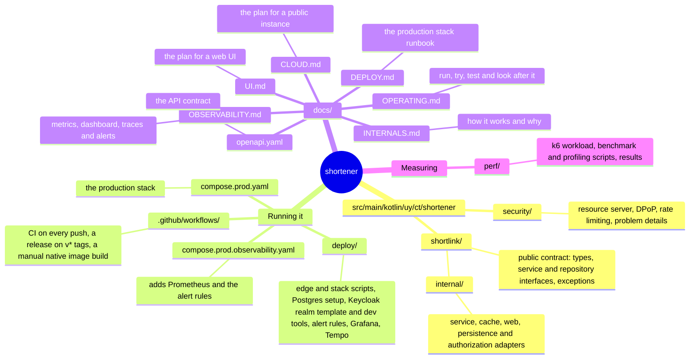

# shortener

[](https://github.com/christ008/shortener/actions/workflows/ci.yml)

A URL shortener built to production standards.

- OAuth2 with sender-constrained (DPoP) tokens and per-client ownership.
- Plain JDBC on Postgres, virtual threads, an in-memory redirect cache.
- Prometheus metrics and OpenTelemetry traces.
- A GraalVM native image on Alpaquita (musl), and a hardened Docker Compose / Swarm stack with an nginx edge.

Spring Boot 4.1 · Kotlin 2.3 · Java 25 · Postgres 18 · Keycloak 26 · nginx · Apache-2.0

## What it does

- Creates links with a generated code (7 base62 characters) or a custom one, and redirects with a `302`.
- Each client owns its links and can list, read and disable them. An administrator can act on any.
- Another client's link looks like it does not exist (`404`).
- A disabled link answers `410 Gone` and keeps its code taken. A takedown reaches every instance within the cache TTL (30 s).
- Every authentication, authorization and rate-limit failure is an RFC 9457 problem detail.

## Run it locally

You need Docker and JDK 25, and `openssl`, which `dev-setup` uses for the passwords. The client below runs on any JDK 17 or newer.

```bash
deploy/keycloak/dev-setup     # once: makes your own dev keys and passwords, and asks what it needs
./gradlew bootRun
```

`dev-setup` shows a banner, then asks for the few things a development setup needs (the Keycloak console password, the
passwords of the two web users and of Postgres), offering a random value for each. It writes a private key for each dev
client, the dev realm that trusts them, and the passwords to `.env`. Git ignores all of it, so nothing secret is in the
repository, and every developer has different keys.

`bootRun` runs the `dev` profile, starts Postgres and Keycloak from `compose.yaml` with those passwords, and applies the
Flyway migrations. Clients authenticate with a signed assertion and get tokens bound to their key, so use the client in
`deploy/keycloak`. It is one Java file that needs only a JDK 17 or newer, with no build step, and it runs on your machine,
not in the stack:

```bash
java deploy/keycloak/DpopClient.java call deploy/keycloak/dev-keys/demo-client.jwk.json demo-client \
  POST http://localhost:8080/api/short-links '{"targetUrl":"https://example.com/some/long/path"}'
```

The response carries the short URL in `Location`. Following it needs no token:

```bash
curl -i http://localhost:8080/<shortCode>
```

How to run it, try it, test it and look after it: [docs/OPERATING.md](docs/OPERATING.md).

Optional observability: `docker compose --profile observability up -d` starts Prometheus, Grafana and Tempo. Open
<http://localhost:3000/d/shortener/shortener>. The `dev` profile samples every trace. What you will see is in
[docs/OBSERVABILITY.md](docs/OBSERVABILITY.md), with screenshots.

The dev keys and passwords are throwaway and belong to your machine. Never use them anywhere real.

## API

| Request | Needs | Answers |
|---|---|---|
| `POST /api/short-links` | `shortlinks:create` (and `shortlinks:claim` for `customCode`) | `201` with the link, `400`, `409` code taken or reserved |
| `GET /api/short-links?page&size&sort` | `shortlinks:read` | `200` with `items`, `page`, `size`, `hasNext`, `totalItems`, `totalPages`; sort by `createdAt` or `shortCode` |
| `GET /api/short-links/{code}` | `shortlinks:read` | `200`, or `404` |
| `DELETE /api/short-links/{code}` | `shortlinks:delete` | `204`, idempotent, or `404` |
| `GET /{code}` | nothing | `302`, `404`, or `410` when disabled |

- `shortlinks:admin` reads and disables any client's links.
- Errors: `401` with a `DPoP` challenge, `403` with `insufficient_scope`, `429` and `503` with `Retry-After`.
- Scope names are configuration (`shortener.shortlink.scopes.*`).
- The full contract is [docs/openapi.yaml](docs/openapi.yaml). A test fails if it drifts from the code.

## Configuration

Everything has a default for local development. Deployed, set `SPRING_PROFILES_ACTIVE=production` (JSON logs, no
internals in errors or health, 5% trace sampling, DPoP required) and the environment variables below:

| Variable | Meaning |
|---|---|
| `SPRING_DATASOURCE_URL`, `_USERNAME`, `_PASSWORD` | Postgres, as the role that serves requests (`shortener_app`) |
| `SPRING_FLYWAY_URL`, `_USER`, `_PASSWORD` | Postgres, as the role that owns the tables (`shortener_migrator`). Only the init container that migrates sets them. With `SHORTENER_MIGRATE_ONLY=true` the process applies the migrations and exits |
| `SPRING_SECURITY_OAUTH2_RESOURCESERVER_JWT_ISSUERURI`, `_JWKSETURI`, `_AUDIENCES` | the identity provider |
| `SHORTENER_SECURITY_DPOP_REQUIRED` | `true` by default; `false` also accepts plain bearer tokens (development and tests only) |
| `SHORTENER_SECURITY_RATELIMIT_PERIP_CAPACITY`, `..._PERCLIENT_CAPACITY` | requests per minute per IP (300) and per client (60) |
| `SERVER_TOMCAT_MAXCONNECTIONS` | connections Tomcat accepts before refusing (500); each costs about 150 KB of heap |
| `SHORTENER_SHORTLINK_TARGETURLS_ALLOWEDHOSTS` | comma-separated hosts the service shortens links to, `example.com` or `*.example.org` for subdomains. Empty, the default, accepts every host. A public instance should set it, or it redirects to anywhere |
| `SHORTENER_SHORTLINK_REDIRECTCACHE_STALEIFERROR` | how long after it was last read a link is still followed when the database cannot be reached (5m); `0` turns it off |
| `SHORTENER_SHORTLINK_REDIRECTCACHE_TTL`, `..._MAXENTRIES` | how long (30s) and how many (100,000) links the redirect cache keeps; `..._ENABLED=false` turns it off |

Environment variable names have no separator inside a word: `SPRING_DATASOURCE_HIKARI_CONNECTIONTIMEOUT`, not
`..._CONNECTION_TIMEOUT`. Spring reads every underscore as a dot, so the second asks for `hikari.connection.timeout`,
which starts the pool while looking for it, and the application then fails with `The configuration of the pool is sealed
once started`.

## Build, test, package

```bash
./gradlew test                  # integration tests use Testcontainers
./gradlew bootBuildImage        # native image on Alpaquita (musl); needs about 7 GB free, takes 3 minutes
```

- The build is pinned in `build.gradle.kts`: Paketo buildpacks by version, BellSoft's builder and run image by digest.
- The image runs as uid 1000, starts in about 0.4 s, and carries `/workspace/health-check` for container health checks.
- `perf/smoke.sh` exercises every endpoint with real tokens against a running instance.

## Deploy

`compose.prod.yaml` is the production stack, for Docker Swarm or one host with Compose:

- An nginx edge with TLS, and two application instances behind it, health-gated rolling updates with automatic rollback.
- A migration job that alone holds the credentials of the role that owns the tables, and a Postgres you can replace
  with a managed one.
- Every container read-only, without capabilities, non-root and bounded. Secrets are files, not variables.
- An optional overlay with Prometheus, the Postgres exporter and the alert rules.

Runbook: [docs/DEPLOY.md](docs/DEPLOY.md). Design and what it gives up against Kubernetes:
[docs/INTERNALS.md](docs/INTERNALS.md#deployment).

## Performance

One laptop, app limited to 2 cores and 512 MB:

- The JVM and the native image both serve about 5,000 requests a second at a redirect p99 of 1 ms.
- The native image starts in 0.4 s.
- The redirect cache and a connection limit keep the native image stable under overload.

Method, numbers and the investigation: [docs/INTERNALS.md](docs/INTERNALS.md#performance). Read the warning there
before running load tests.

## Layout



Releases are tagged `v0.x.0`, one minor version per change.

## License

Copyright 2026 Christian Tejeda. Licensed under the [Apache License, Version 2.0](LICENSE).
