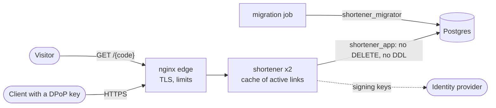

# shortener

[](https://github.com/christ008/shortener/actions/workflows/ci.yml)

**TL;DR** A URL shortener built to be safe on the public internet.

- **A stolen token is useless.** Each request is signed by the client's own key, and clients see only their own links.
- **A link can't be hijacked.** A short code is never reused, and in production the app has no permission to change one.
- **Fast.** Redirects come from memory, and the service starts in under a second.
- **Ready to run.** One command deploys it with TLS, metrics and alerts, after checking the release's signature.
- **Every choice explained.** A threat model, a short record per decision with its cost, and a test behind each guarantee.

> [!IMPORTANT]
> Not yet run in public: performance figures come from load tests on one machine. See [Limitations](docs/INTERNALS.md#limitations)
> and what a public instance still needs ([CLOUD.md](docs/CLOUD.md)).

<p align="center">
  
</p>

Spring Boot 4.2 · Kotlin 2.4 · Java 25 · Postgres 18 · Keycloak 26 · nginx · Apache-2.0

## What it does

- Creates a link with a generated code (7 base62 characters) or a chosen one, and redirects `GET /{code}` with `302`, not `301`,
  so a browser does not keep following a link after a takedown.
- A client lists, reads and disables its own links. Another client's link answers `404`, and an administrator can act on any.
- A disabled link answers `410` and keeps its code: a code is never handed out twice. A takedown reaches every instance within
  the cache TTL (30 s).

Not goals: editing a link's target, expiry, teams or shared ownership, several short domains, and billing. Click analytics
and a web UI ([docs/UI.md](docs/UI.md)) are planned, not built.



## Worth reading

The problems that took the most work, and where each is written up:

- **A stolen token is useless, across instances that share no state.** DPoP-bound tokens with stateless HMAC nonces any
  instance can check. [SECURITY.md](docs/SECURITY.md#dpop-rfc-9449), [ADR 0032](docs/adr/0032-dpop-nonces.md)
- **A code can never be reused, even by a compromised application.** The application's database role cannot delete a row or
  change a code. [Roles and migrations](docs/INTERNALS.md#roles-and-migrations)
- **Redirects survive a database outage, for a bounded time.** A cache of active links with `stale-if-error`, and readiness
  that leaves the database out. [Redirect cache](docs/INTERNALS.md#redirect-cache), [ADR 0012](docs/adr/0012-readiness-excludes-the-database.md)
- **Why the native image ran out of heap at 5,000 req/s,** found with JFR and a heap dump, and closed by a connection limit.
  [Native image under overload](docs/INTERNALS.md#native-image-under-overload)
- **What each invariant rests on:** the test that fails without it. [Invariants](docs/DESIGN.md#invariants)

## Run it

Needs Docker and JDK 25. The reference DPoP client needs JDK 17 or newer.

```bash
deploy/keycloak/dev-setup     # once: generates keys and passwords (builds its tools the first time)
./gradlew bootRun             # starts Postgres and Keycloak from compose.yaml, then the app on :8080
```

> [!WARNING]
> `dev-setup` writes git-ignored keys, a dev realm and `.env`. These are throwaway: never use them anywhere real.

Then call it, rehearse the production stack on your machine, and go to production with a checklist:
[docs/OPERATING.md](docs/OPERATING.md). Metrics, dashboard and traces: `docker compose --profile observability up -d`, then
<http://localhost:3000/d/shortener/shortener> ([OBSERVABILITY.md](docs/OBSERVABILITY.md)).

## API

| Request | Scope | Success | Errors |
|---|---|---|---|
| `POST /api/short-links` | `shortlinks:create` | `201` with the link and its `Location`. The code is generated, and `shortUrl` is the URL to share | `400` |
| `PUT /api/short-links/{code}` | `shortlinks:create` and `shortlinks:claim` | for a code you choose: `201`, or `200` when you already have this link, so repeating is safe | `400`; `409` when the code is reserved, taken, or yours for another target |
| `GET /api/short-links?page&size&sort` | `shortlinks:read` | `200` with `items`, `page`, `size`, `hasNext`, `totalItems` and `totalPages`. Sort by `createdAt` or `shortCode` | none of its own |
| `GET /api/short-links/{code}` | `shortlinks:read` | `200` | `404` |
| `PATCH /api/short-links/{code}` with `{"disabled": true}` | `shortlinks:delete` | `200` with the link, disabled. Repeating is safe | `400`; `404` |
| `GET /{code}` | none | `302` | `404`; `410` when disabled |

- `shortlinks:admin` reads and disables any client's links.
- Errors: `401` with a `DPoP` challenge, `403` with `insufficient_scope`, `429` and `503` with `Retry-After`.
- Scope names are configuration (`shortener.shortlink.scopes.*`).
- Contract: [docs/openapi.yaml](docs/openapi.yaml). A test fails if it drifts from the code.

## Configuration

Defaults suit development. A deployment sets `.env` and a few secret files, and the `production` profile (JSON logs, no internals
in errors or health, 5% trace sampling, DPoP required) is set by the stack. Every variable, where it goes and what reads it:
[docs/REFERENCE.md#configuration](docs/REFERENCE.md#configuration).

## Evidence

- **Tests:** 380, all passing, 255 of them on the service. Line coverage 96.9%, branch coverage 87.5%.
- **Mutation score:** 92% on the core logic (95 mutants), with the survivors explained.
  [INTERNALS.md#testing](docs/INTERNALS.md#testing)
- **Security:** the controls, and a STRIDE model with a register of findings, severities, fix dates and the risks accepted.
  [SECURITY.md](docs/SECURITY.md), [THREAT_MODEL.md](docs/THREAT_MODEL.md)
- **Performance:** one desktop, a synthetic load of 99% redirects on links the cache holds. With 2 CPUs the native image of the stack sustains 6,000 req/s behind its edge, and a JVM at least 12,000.
  The figure is for the cache, not the database. Method and a warning to read before load testing:
  [INTERNALS.md#performance](docs/INTERNALS.md#performance).
- **Decisions:** one record per decision, with what it costs. [docs/adr/](docs/adr/README.md)

## Build, test, package

```bash
./gradlew test                  # integration tests use Testcontainers (Docker)
./gradlew bootBuildImage        # native image on Alpaquita (musl); about 7 GB free, 3 minutes
perf/smoke.sh                   # every endpoint, with real tokens, against a running instance
```

## Deploy

`deploy/stack/compose.prod.yaml` is the production stack, for Docker Swarm or one host with Compose: an nginx edge with TLS, two
application tasks, a migration job, Postgres, and optional overlays in `deploy/stack/overlays/` for Prometheus, Keycloak and
Postgres backups with a replica. `deploy/stack/deploy.sh` verifies the image's signature before it deploys.

| Document | Contents |
|---|---|
| [OPERATING.md](docs/OPERATING.md) | develop, rehearse production, a go-live checklist, call the API, troubleshoot |
| [REFERENCE.md](docs/REFERENCE.md) | every configuration key, secret file and script |
| [DEPLOY.md](docs/DEPLOY.md) | production stack runbook: first deploy, updates, Keycloak, backups |
| [OBSERVABILITY.md](docs/OBSERVABILITY.md) | metrics, dashboard, traces, alerts, logs |
| [INTERNALS.md](docs/INTERNALS.md) | how it works: request flows, database, cache, native image, deployment, tests and measurements |
| [DESIGN.md](docs/DESIGN.md) | invariants, and why the code has this shape: modules, types, design review |
| [SECURITY.md](docs/SECURITY.md) | the controls: filter chain, tokens, DPoP, scopes, rate limits |
| [THREAT_MODEL.md](docs/THREAT_MODEL.md) | STRIDE, OWASP, a register of findings with their fixes, and the risks accepted |
| [adr/](docs/adr/README.md) | decision records |
| [CLOUD.md](docs/CLOUD.md), [UI.md](docs/UI.md) | plans for a public instance and a web UI (nothing built) |
| [openapi.yaml](docs/openapi.yaml) | API contract |

Releases are tagged `v0.x.0`, one minor version per change.

## Built with AI

Built with [Claude Code](https://claude.com/claude-code) between 2026-09-19 and 2026-10-08: 118 of the 164 commits name Claude
as co-author.

- **I set the direction, Claude did most of the writing.** I set the requirements and constraints, and reviewed each change.
- **Iterative, not one-shot.** Most of the work took several rounds of proposal, review and rework: designs, code, tests and
  these docs alike. Some choices were reversed outright, and the superseded ADRs keep that history.
- **Generated code is checked, not trusted.** Each claim in the docs names its test or measurement, mutation testing shows
  the tests catch real faults, and a smoke test exercises the shipped native image.
- **The reasoning is written down.** The ADRs and the threat model were drafted with Claude from the commit history, each with
  its cost and the alternatives it rejected.

## License

Copyright 2026 Christian Tejeda. Licensed under the [Apache License, Version 2.0](LICENSE).
