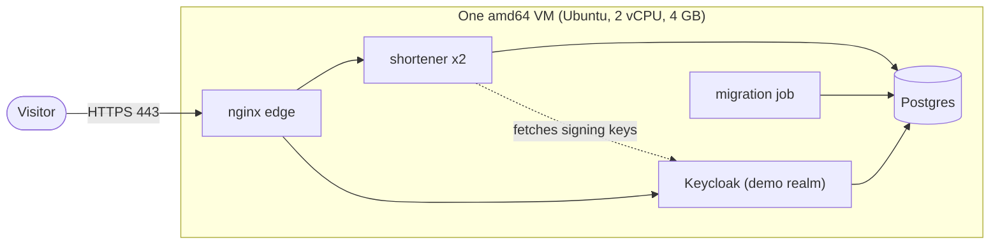

# A public instance in the cloud

A plan for putting a working instance where anyone can try it. **Status: a plan. Nothing here has been deployed.** The
production stack itself is rehearsed on one machine ([DEPLOY.md](DEPLOY.md)); the pieces listed under
[What is missing](#what-is-missing) are not built yet.

- [Goal](#goal)
- [The shape](#the-shape)
- [Decisions to make](#decisions-to-make)
- [What is missing](#what-is-missing)
- [Steps](#steps)
- [Keeping a public instance safe](#keeping-a-public-instance-safe)
- [Cost and teardown](#cost-and-teardown)
- [The managed alternative](#the-managed-alternative)

## Goal

Someone with a terminal and a JDK 17 or newer can follow the README against a real URL: get a token, create a link,
follow it, see that another client cannot see it. No account of theirs, nothing to install but the JDK.

## The shape

One small virtual machine running the stack of `compose.prod.yaml`, because that is what has been verified, and because
Swarm needs no more than one node to run it:

- **Edge:** nginx with a Let's Encrypt certificate for one host name.
- **Identity:** the demo needs an identity provider on the same host, because visitors need tokens. It is Keycloak with a
  realm made for the demo, behind the edge under `/realms/shortener` ([DEPLOY.md](DEPLOY.md#keycloak)).
- **Database:** the stack's Postgres on the VM's disk, with a nightly `pg_dump` to somewhere else. Nothing in it is
  precious.
- **Image:** `ghcr.io/christ008/shortener:<version>`, published and signed by the Release workflow. Only amd64 is built,
  so the VM must be amd64.

## Decisions to make

| Decision | Options | Notes |
|---|---|---|
| Provider | any provider with an amd64 Ubuntu VM: Hetzner, DigitalOcean, Lightsail, Compute Engine | not decided. A 2 vCPU, 4 GB machine costs a few euros or dollars a month at the low-cost providers |
| Host name | a domain or subdomain you control | needed for the certificate and for the token `iss` claim, which must equal the public issuer URL |
| Who can create links | the dev clients' public keys, or a demo client whose key is published in the README | see the safety section: with open creation, the target allowlist is not optional |
| Certificate | Let's Encrypt with `certbot` on the host, or nginx's ACME module | issuance is untested either way |

## What is missing

1. ~~**A Keycloak service for the stack**~~ Built: `compose.prod.keycloak.yaml`, with its own database, the public issuer, behind
   the edge, rehearsed on one machine ([DEPLOY.md](DEPLOY.md#keycloak), [ADR 0025](adr/0025-keycloak-in-the-stack.md)).
2. ~~**An edge route for `/realms`**~~ Built: only the shortener realm and its static files, with a limit on the token endpoint.
3. ~~**A demo realm.**~~ Built: `./gradlew productionRealm` makes it from the public keys of `demo-client`, which can create, read and
   disable its own links, and `admin-client`, whose key only the operator holds. No users, TLS required, brute-force detection.
   Not built: the `shortener-ui` client and web users, which wait for the web UI.
4. **Certificate issuance and renewal**, with a reload of the edge.
5. **A bootstrap script** that, on a fresh VM, installs Docker, makes the secrets, deploys, and installs the nightly dump.
6. **Backups and a restore test.** The stack has none.

## Steps

The order, once the parts above exist:

1. Create the VM. Open 22 (from your address only), 80 and 443. Create the DNS record for the host name.
2. Install Docker, `docker swarm init`, label the node (`shortener.postgres=true`).
3. Obtain the certificate for the host name and place it, with the key, in the secrets directory.
4. Make the secrets (database passwords, Keycloak's two), the production realm and the `.env`: image version, `PUBLIC_URL`, issuer, key endpoint, and
   `ALLOWED_TARGET_HOSTS` (the stack does not start without it).
5. `KEYCLOAK=1 OBSERVABILITY=1 deploy/stack/deploy.sh <version>`, then check with `docker service ls`.
6. Run `perf/smoke.sh` against the public URL with the demo client.
7. Publish the demo client's key and the three commands from the README with the URL.
8. Check the Prometheus alerts, and set a billing alert at the provider.

## Keeping a public instance safe

A URL shortener that anyone can create links in is a favorite of phishers: the link looks like yours and goes anywhere.
Before anyone is invited:

- **Restrict targets.** Set `SHORTENER_SHORTLINK_TARGETURLS_ALLOWEDHOSTS` to a short list, for example `example.com` and
  `*.example.org`. Anything else is refused with `400`. With no list the production stack does not start, unless `ALLOW_ANY_TARGET=true` says on purpose that it redirects to anywhere: never on a public instance.
- **Use the production realm** that `./gradlew productionRealm` writes, never the dev one.
- **Keep the limits.** Per address (300 a minute) and per client (60 a minute) are the defaults. Do not raise them.
- **Expect to take links down.** Keep an administrator client whose key only you hold, and know the call:
  `DELETE /api/short-links/<code>`.
- **Keep it small.** Few people, no promise of availability, and say so in the README next to the URL.
- **Do not store anything you would mind losing.** The database is one disk on one machine.

Known limits that apply here: rate limits and the DPoP replay cache are per task, there is no backup, and the VM is a
single point of failure.

## Cost and teardown

- The VM is the whole bill, plus a little for the snapshot or the off-site dump.
- Set a billing alert before the first deploy.
- Teardown is `docker stack rm shortener`, then delete the VM and the DNS record. Nothing else is created.

## The managed alternative

A container service with a managed Postgres has nothing to patch and no disk to lose. It costs more, mainly for the
database, and needs reshaping: the edge becomes the platform's load balancer, the migration job becomes a one-off task
that runs before each release, Keycloak needs its own service and database, and the stack's network isolation becomes the
provider's. It is worth it if the instance is meant to last, and is not worth it for a demo.
