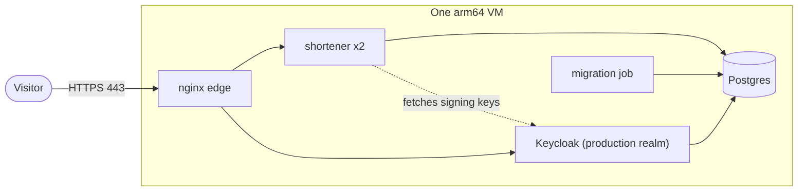

# A public instance in the cloud

Plan for an instance anyone can try. The production stack is rehearsed on one machine ([DEPLOY.md](DEPLOY.md)).

> [!NOTE]
> A plan. Nothing here has been deployed.

- [Goal](#goal)
- [Shape](#shape)
- [To decide](#to-decide)
- [Missing](#missing)
- [Steps](#steps)
- [Safety](#safety)
- [Cost and teardown](#cost-and-teardown)

## Goal

Someone with a terminal and a JDK 17 or newer follows the README against a real URL: gets a token, creates a link, follows
it, and sees that another client cannot see it.

## Shape

One arm64 VM (Ubuntu, Oracle's Always Free Ampere A1: up to 4 OCPU and 24 GB for the account, of which 2 OCPU and 12 GB would do) running `deploy/stack/compose.prod.yaml` on a single-node Swarm:

- **Edge:** nginx with a Let's Encrypt certificate for one host name.
- **Identity:** Keycloak with the production realm, behind the edge under `/realms/shortener` ([DEPLOY.md](DEPLOY.md#keycloak)).
- **Database:** the stack's Postgres on the VM's disk, backed up by the [backups overlay](DEPLOY.md#backups-and-a-replica), Keycloak's database included, to a repository off the VM.
- **Image:** `ghcr.io/christ008/shortener:<version>`, arm64 only ([ADR 0036](adr/0036-jvm-image-for-arm64.md)). An amd64 host builds its own with `./gradlew bootBuildImage`.
- **Not measured on Ampere:** the figures in [Performance](INTERNALS.md#performance) are from an x86-64 desktop.

## To decide

| Decision | Options |
|---|---|
| Provider | Oracle Cloud, Always Free Ampere A1 (arm64). Another arm64 VM works; an amd64 one needs the image built there |
| Host name | a domain or subdomain you control; the token `iss` must equal the public issuer URL |
| Who can create links | the dev clients' public keys, or a demo client whose key is published in the README |
| Certificate | `certbot` on the host, or nginx's ACME module (issuance untested either way) |

## Missing

Built: the Keycloak overlay, the edge route for `/realms`, the production realm
(`./gradlew productionRealm`: `demo-client` and `admin-client`, no users), and backups with a restore test
([DEPLOY.md](DEPLOY.md#backups-and-a-replica)), with the repository on the VM's disk.

Not built:

1. Certificate issuance and renewal, with an edge reload.
2. A bootstrap script for a fresh VM: install Docker, make secrets, deploy, schedule the backups.
3. The backup repository off the VM.
4. The `shortener-ui` client and web users (they wait for the [web UI](UI.md)).

## Steps

1. Create the VM. Open 22 (from your address only), 80 and 443. Create the DNS record.
2. Install Docker, `docker swarm init`, label the node `shortener.postgres=true`.
3. Obtain the certificate and place it with the key in the secrets directory.
4. Make the secrets (database passwords, Keycloak's two), the production realm and `.env`: image version, `PUBLIC_URL`,
   issuer, key endpoint, `ALLOWED_TARGET_HOSTS`.
5. `KEYCLOAK=1 OBSERVABILITY=1 POSTGRES_HA=1 deploy/stack/deploy.sh <version>`, then `docker service ls`. The backups overlay needs its image, a secret and a node label ([DEPLOY.md](DEPLOY.md#backups-and-a-replica)).
6. `perf/smoke.sh` against the public URL with the demo client.
7. Publish the demo client's key and the README commands with the URL.
8. Check the Prometheus alerts. Set a billing alert at the provider.

## Safety

Before anyone is invited:

- Set `SHORTENER_SHORTLINK_TARGETURLS_ALLOWEDHOSTS` to a short list (`example.com`, `*.example.org`). Anything else is
  refused with `400`. Never use `ALLOW_ANY_TARGET=true` on a public instance.
- Use the realm `./gradlew productionRealm` writes, never the dev one.
- Keep the default [rate limits](REFERENCE.md#tunables).
- Keep an administrator client whose key only you hold. Takedown: `PATCH /api/short-links/<code>` with `{"disabled": true}`.
- Say in the README, next to the URL, that availability is not promised.
- Store nothing you would mind losing: one disk, one machine.

Known limits: rate limits and the DPoP replay cache are per task, the VM is a single point of failure, and backups stay on its disk until the repository leaves it.

## Cost and teardown

- The VM is the whole bill, plus the snapshot or off-site dump. Set a billing alert before the first deploy.
- Teardown: `docker stack rm shortener`, delete the VM and the DNS record.
