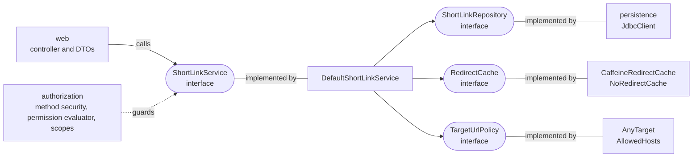

# Design

The invariants the code keeps, and why it has its shape: the modules and the types. Each decision has a record with its cost and
alternatives in the [ADRs](adr/README.md).

- [Invariants](#invariants)
- [Structure](#structure)
- [Domain types](#domain-types)
- [Design review](#design-review)
- [Decisions not in an ADR](#decisions-not-in-an-adr)

## Invariants

Twelve statements the design must keep true, and what holds each one. A test is a result; a decision or a file is a design. Where an
invariant has a limit, the limit is part of it.

### Short codes

| # | Invariant | Held by |
|---|---|---|
| 1 | A code is never reused | the code is the primary key and a claim is one atomic `INSERT ... ON CONFLICT DO NOTHING`; the application's role can neither delete a row nor change a code, and a disabled link keeps its code. `DatabaseRolesTest`, `ShortCodeRaceIntegrationTest`, `DefaultShortLinkServiceTest`. [ADR 0013](adr/0013-three-database-roles-and-a-migration-job.md) |
| 2 | A disabled link answers `410` | a disabled link is a `410` at `GET /{code}`, and its code stays taken. `ShortLinkWebTest`, `DefaultShortLinkServiceTest`. [ADR 0033](adr/0033-link-is-a-resource-and-disabling-is-a-patch.md) |
| 3 | A redirect never needs a database write | the redirect path only reads, through the cache. `DefaultShortLinkServiceTest` counts the writes of a miss, a hit and an expiry: none |
| 4 | Staleness is bounded | a link disabled on another instance is followed for at most the cache TTL. **While the database is unreachable the bound is `stale-if-error`**, both [tunables](REFERENCE.md#tunables), and `shortlink_redirect_cache_stale_total` counts each such redirect. `DefaultShortLinkServiceTest`, `StorageUnavailableIntegrationTest`. [ADR 0011](adr/0011-in-process-redirect-cache.md) |
| 5 | The application's credentials cannot change the schema | `shortener_app` holds `SELECT`, `INSERT` and `UPDATE (disabled_at, disabled_by)`, and the tables belong to `shortener_migrator`. `DatabaseRolesTest`. **In the stack only:** `bootRun` connects as the development superuser |

### Security

| # | Invariant | Held by |
|---|---|---|
| 1 | Production decides where links may point | without `allowed-hosts` or `allow-any=true` the application does not start. `TargetUrlPolicyDecisionTest`. [ADR 0015](adr/0015-target-host-policy.md), [0023](adr/0023-production-must-decide-its-targets.md) |
| 2 | DPoP is required | the default is on, and **`production` does not start with it off**, whatever an environment variable says. `DpopRequiredInProductionTest`, `ProfilesTest`, `ComposeStackTest`. [ADR 0006](adr/0006-require-dpop-bound-tokens.md), [0035](adr/0035-production-refuses-bearer-tokens.md) |
| 3 | The server enforces who owns a link | method security on the service, not the controller; another client's link is a `404`. `ShortLinkAuthorizationTest`, `UserOwnershipIntegrationTest`. [ADR 0007](adr/0007-owner-claim-and-ownership-rule.md) |
| 4 | Development cryptographic material is generated on the machine that uses it | `dev-setup` writes the keys, realm and passwords, and Git ignores them. `RepositoryHoldsNoSecretsTest` |
| 5 | Production secrets are never repository configuration | secrets are files read through `configtree`, never variables, and no tracked file holds a private key. `ComposeStackTest`, `RepositoryHoldsNoSecretsTest`. [ADR 0019](adr/0019-no-secrets-in-git.md). The k6 summaries under `perf/results/` are cleaned of the proof key and token that k6 copies into them (`perf/scrub-k6-summary.sh`) |

### Operations

| # | Invariant | Held by |
|---|---|---|
| 1 | An invalid production security configuration stops the start | in `production` the application refuses: no decision on target hosts, DPoP off, no shared nonce secret, or a DPoP filter missing from the chain. `TargetUrlPolicyDecisionTest`, `DpopNoncesConfigurationTest`, `DpopRequiredInProductionTest`. **Not covered:** the identity provider's addresses. The image keeps `localhost` defaults because a native image needs them when it is built (`ProfilesTest`), and the stack requires `ISSUER_URI` and `JWKS_URI` itself |
| 2 | Migrations run apart from the application | the migration job holds the only credentials that can alter the schema, migrates and exits. The application's role could not migrate if it tried. `ComposeStackTest`, `MigrateOnlyRunnerTest`. [ADR 0013](adr/0013-three-database-roles-and-a-migration-job.md) |
| 3 | Readiness and liveness are different questions | readiness leaves the database out, so an outage does not take the instances out of rotation, and liveness stays up. The container health check asks readiness. `StorageUnavailableIntegrationTest`, `ComposeStackTest`. [ADR 0012](adr/0012-readiness-excludes-the-database.md) |

## Structure

Two Spring Modulith modules: `shortlink` and `security`. In `shortlink` the public package is the contract and
everything else is an adapter behind it.

ArchUnit tests enforce what Modulith does not check inside a module:

- The public API depends on no JDBC type and no security type. It does use Spring Data's `Page` and `Pageable`, on purpose
  (see [Design review](#design-review)).
- The web adapter talks only to the service interface.
- Nothing depends on the web or persistence adapters.
- JDBC types never leave `persistence`.

## Domain types

Absence and "unknown" are types, not nulls, so callers match on them and the compiler checks every case.

| Type | Replaces | Cases |
|---|---|---|
| `LinkStatus` | nullable `disabledAt` and `disabledBy` | `Active`, `Disabled(at, by)` |
| `Actor` | nullable creator and disabler names | `Client(name)`, `Unknown` for links stored before creators were recorded |
| `CreatedByFilter` | nullable `createdBy` in listings | `Anyone`, `Only(client)` |
| `LinkLookup` | nullable `findByShortCode` and `disable` | `Found(link)`, `Missing` |
| `InsertResult` | nullable `insertIfAbsent` | `Created(link)`, `Taken` |
| `RedirectCache` | a nullable cache field | `CaffeineRedirectCache`, `NoRedirectCache` (does nothing) |
| `RateLimitDecision` | nullable wait | `Allowed`, `Limited(retryAfter)` |
| `RateLimitKey` | nullable key | `Of(value)`, `Unlimited` |
| `AuthScheme` | nullable scheme | `DPOP`, `BEARER`, `NONE` |

Nulls remain only where a framework owns the signature: JDBC columns, Caffeine's loader, the request DTO, Spring
Security callbacks. They are converted at that boundary, and the JSON API still sends `null` for an absent
`createdBy` or `disabledAt` because the contract says so.

## Design review

A pass against SOLID and Tell, Don't Ask, and for what the compiler can check. Most findings were fixed with standard Kotlin:
sealed types, exhaustive `when`, and rules moved onto the object that owns the data. Two were kept with a cost: the service
opens its own observations, and the contract exposes Spring Data's paging types.

The review, finding by finding

### Checked by the compiler

| Where | Now | Gives |
|---|---|---|
| `ShortLinkException` | `sealed`: the failures are exactly the subclasses in the package | no failure the API contract does not describe can be added from outside; a test lists them |
| `LinkStatus`, `Actor`, `LinkLookup`, `InsertResult`, `CreatedByFilter`, `RateLimitDecision`, `RateLimitKey` | sealed interfaces | a `when` over them needs every case |
| `ShortLinkResponse`, `CaffeineRedirectCache` | exhaustive `when` where `as?` casts stood | a new case is a compile error, not a silent `null` |
| `SecurityProblemResponder` challenge | `when` over `AuthScheme`, not over booleans | each scheme's answer is stated, and a new scheme must be handled |
| `ShortLinkScopes` | immutable, bound through the constructor | the authorization rules cannot change after start |

Left as they are:

- **Kotlin `internal`.** It means module-wide, and this is one module, so it would hide nothing. The boundaries are held
  by Spring Modulith and the ArchUnit tests instead.
- **Value classes** for `ShortCode`. Spring MVC, Jackson and native image support for them is thinner than for data
  classes, and the gain is one allocation.
- **Unchecked cast in `NotFoundWhenDenied`.** The first argument of a denied call is a framework-supplied `Object`.

### Tell, don't ask

Callers were pulling fields out of an object to decide something that the object knows. Each now asks the object to do
it, which puts the rule in one place and lets the type change without its callers.

| Before | Now |
|---|---|
| the evaluator compared `link.createdBy` with the caller | `link.isCreatedBy(client)` |
| the service read `link.isDisabled` and threw | `link.requireActive()` |
| the service checked `shortCode.value in RESERVED_CODES` | `shortCode.requireClaimable()` |
| the controller chose the listing filter from the caller's authority | `CreatedByFilter.of(requested, caller, isAdministrator)`, with tests |
| the service parsed the target and would have had to know which hosts are allowed | a `TargetUrlPolicy` says whether a target is accepted |

### SOLID

| Principle | Finding | Decision |
|---|---|---|
| Single responsibility | `DefaultShortLinkService` also opens the observations around two repository calls | Kept, [see below](#why-the-service-keeps-its-observations) |
| Open/closed | which targets are accepted was going to be an `if` in the service | Done: `TargetUrlPolicy`, with `AnyTarget` and `AllowedHosts`. A new rule is a new implementation |
| Liskov | the two null objects, `NoRedirectCache` and `AnyTarget`, must honor their contracts | Done: each has tests for its contract |
| Interface segregation | the repository has four operations, each used by the service or `ManageableLinks` | Nothing to split |
| Dependency inversion | the service depends on interfaces for the repository, the cache, the generator and the policy. Its public contract exposes Spring Data's `Page` and `Pageable` | Kept, with a cost: [see below](#why-the-contract-exposes-spring-datas-paging-types) |

#### Why the service keeps its observations

The `shortlink.load` observation marks a redirect that missed the cache. A repository decorator would also observe the reads that
decide who may see a link, which is not what the observation is for.

#### Why the contract exposes Spring Data's paging types

- The ArchUnit tests keep JDBC and security types out of the contract, and accept `Page` and `Pageable` on purpose.
- Own paging types would be a copy of them. The web adapter would then parse `page`, `size` and `sort` itself, which
  `Pageable`'s resolver does today, with the defaults and the cap of `spring.data.web.pageable.*`.
- The cost: the contract is tied to `spring-data-commons`, a library with no persistence in it. A different paging library would
  change the contract, not only an adapter.

## Decisions not in an ADR

The rest are in the [ADR index](adr/README.md).

- **Spring facilities over bespoke code.** Method security with a `PermissionEvaluator`, `Pageable` and `Page`, Spring
  Security's resource server, DPoP and RFC 9728 metadata, MVC's problem details. Custom code is limited to what Spring
  lacks: the Bearer refusal, the DPoP nonces, rate limiting and the native hints.
- **Reproducible image.** Everything the build downloads is pinned, by version where one exists and by digest where
  not.
