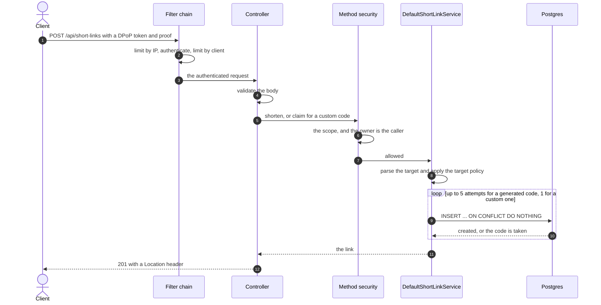
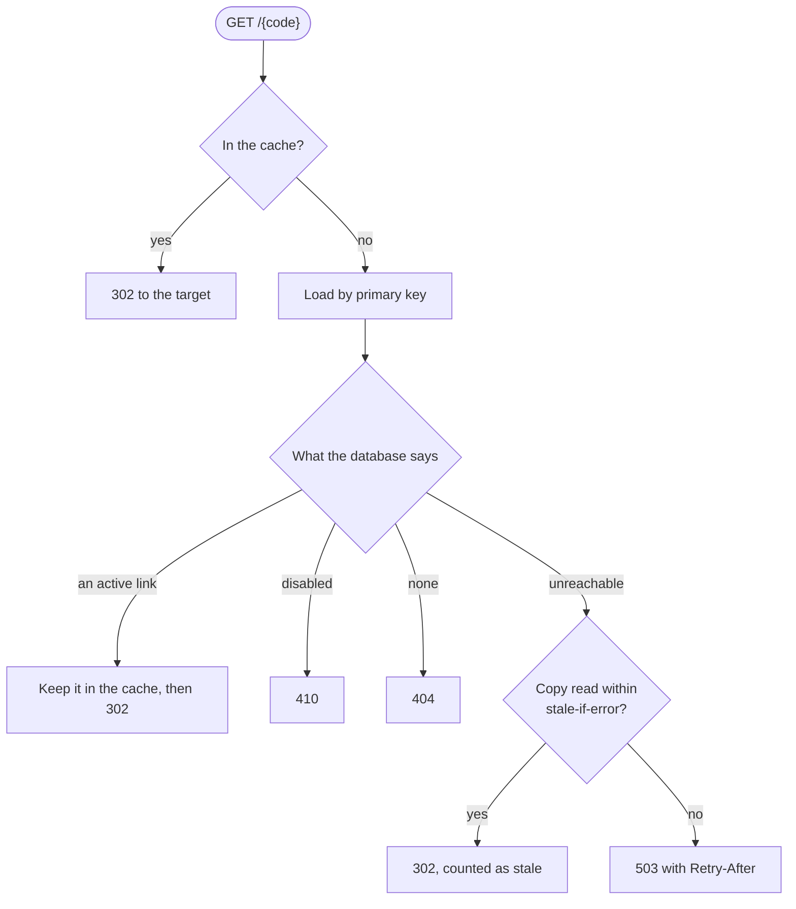
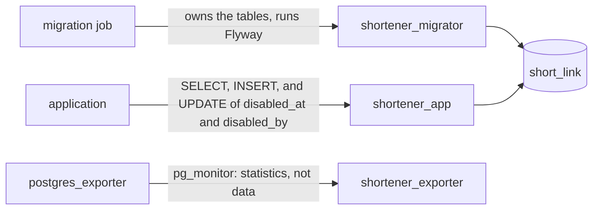
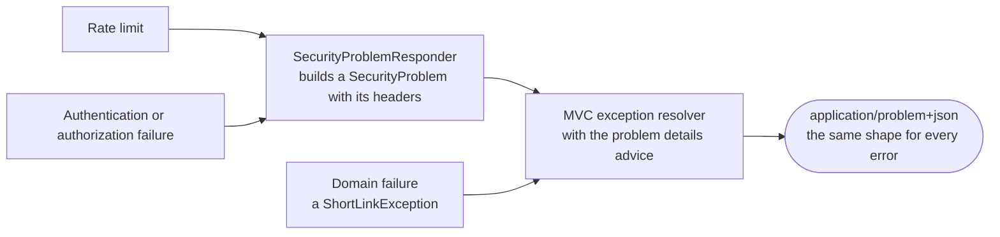
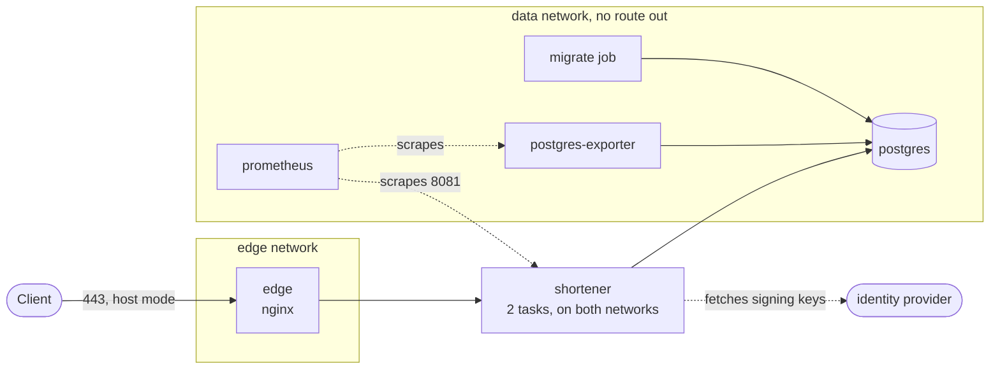
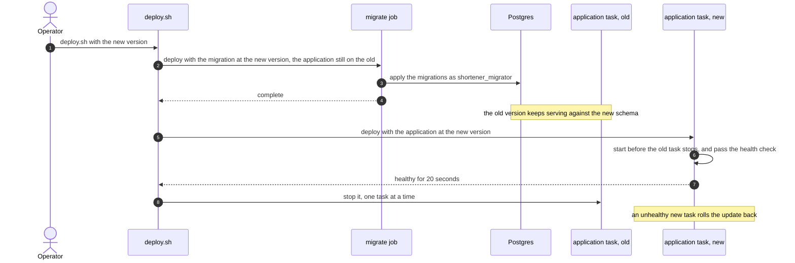

# Internals

How the service works: a request from end to end, the database, the cache, the native image, the deployment, and the evidence
(tests and measurements). A statement that names a test or a measurement is a result; one that names neither is a decision, and
[Limitations](#limitations) says what is not shown.

- [Request flows](#request-flows)
- [Persistence](#persistence)
  - [Roles and migrations](#roles-and-migrations)
  - [Connections](#connections)
- [Concurrency](#concurrency)
- [Redirect cache](#redirect-cache)
- [Errors](#errors)
- [Observability](#observability)
- [Native image](#native-image)
- [Deployment](#deployment)
  - [Hardening](#hardening)
  - [Edge](#edge)
  - [Rollouts](#rollouts)
- [Releasing](#releasing)
- [Testing](#testing)
  - [What is counted](#what-is-counted)
  - [Coverage (Kover)](#coverage-kover)
  - [Mutation testing (PIT)](#mutation-testing-pit)
  - [Where the evidence is](#where-the-evidence-is)
- [Performance](#performance)
- [Limitations](#limitations)

## Request flows

**Create** (`POST /api/short-links`)

1. Rate limit by IP, authenticate (DPoP, and bearer only where DPoP is not required), rate limit by client.
2. The controller validates the body and calls `shorten` (`POST`) or `claim` (`PUT`, the code from the path).
3. Method security checks the scope (`create`, plus `claim` for a custom code) and that the owner argument is the caller.
4. The service validates the URL again as a domain rule, then allocates a code:
   - Generated: drawn with `SecureRandom`, inserted with `INSERT ... ON CONFLICT DO NOTHING`, retried up to 5 times,
     then `ShortCodeExhaustionException`.
   - Custom: one attempt. `api`, `actuator`, `error` and `app` are reserved so they cannot shadow routes. When the code is taken
     the service reads it: the caller's own link for the same target is the answer (`200`, nothing created, no audit event), anything
     else is `409`. A link's target never changes, so a link that matches now always did.
5. `201` (`200` for a repeated claim) with the link and, for `201`, a `Location` header, `/api/short-links/{code}`, built from the forwarded host and scheme. The link
   carries its `shortUrl`, `/{code}` on the same host, which is the URL to share.

**Redirect** (`GET /{code}`), public and the hot path

- Looks up the [redirect cache](#redirect-cache), then loads by primary key on a miss.
- `302`, `404` when unknown, `410` when disabled.
- `302`, not `301`: a browser keeps a `301` indefinitely, which would outlive a takedown ([ADR 0011](adr/0011-in-process-redirect-cache.md)).
- A code is never handed out twice. It is the primary key, a disabled link keeps its row, and the application's database role
  has no `DELETE` and can update only `disabled_at` and `disabled_by`
  ([ADR 0013](adr/0013-three-database-roles-and-a-migration-job.md)). In development, where the application connects as
  the database's superuser, that is the code's behaviour and not the database's.

**Disable** (`PATCH /api/short-links/{code}` with `{"disabled": true}`)

- Loads the link through `ManageableLinks`, whose `@PostAuthorize` lets only the owner or an administrator see it.
- Anyone else gets `404`, so a link's existence is not revealed.
- The update is `COALESCE`-based, so disabling twice keeps the first actor and time. The answer is the row the update returns, `200`.
- Only `{"disabled": true}` is accepted. Enabling again is refused until a rule says who may undo a takedown.

**List** (`GET /api/short-links`)

- Takes a Spring `Pageable` (`page`, `size`, `sort`), capped at 200 (`spring.data.web.pageable.*`).
- A client lists its own links. An administrator lists one client's or all.
- Returns a Spring `Page`: the items, whether another page follows, and the totals (`totalItems`, `totalPages`), so a
  client can offer any page, including the last.
  - `hasNext` comes from fetching `size + 1` rows.
  - The total is read from the page when it ends the listing (the offset plus the rows returned), and for an empty first
    page. Only a page with more behind it, or a page past the end, runs `SELECT count(*)`, filtered the same way.
  - The count is a separate statement, so a link created between the two can make them differ by one.
  - Counting scans the matching rows. Per client that is a small indexed range. For an administrator's unfiltered
    listing it is the whole table, which is fine at this size; revisit with an estimate if it grows large.
  - A page past the end is empty and carries the real totals, so a client can recover.
- Sortable by `createdAt` and `shortCode` only, from a whitelist that maps to columns, so a sort parameter never
  reaches SQL as text. Ties break on the short code, so pages never overlap.

## Persistence

Postgres 18 with plain JDBC through `JdbcClient`. Two statements dominate and both need SQL that JPA hides
(`ON CONFLICT`, `RETURNING`, collation).

- `short_link` has the short code as its natural primary key.
- Constraints keep bad data out whatever writes it: the code matches `^[A-Za-z0-9_-]{3,32}$`, the target starts with
  `http://` or `https://`, and `disabled_at` and `disabled_by` are both null or both set.
- Listing indexes: `(created_at DESC, short_code COLLATE "C" DESC)`, and the same behind `created_by`.
- `COLLATE "C"` matters: the stock Postgres image uses `en_US.utf8`, which orders `Z` and `a` differently from the
  bytes, so sorting by code would differ between databases.
- Migrations are Flyway `V1` to `V6`. The native image prints "Unable to scan location /db/migration". It is harmless:
  migrations apply from the registered resources.
- Storage that cannot serve the request now becomes `StorageUnavailableException`: `503` with `Retry-After: 5`, so it
  reads as retryable.
  - A failure to get a connection (`DataAccessResourceFailureException`).
  - A statement cut off at 5 s (`QueryTimeoutException`).
  - A lock given up after 2 s: an `UncategorizedSQLException` with SQLSTATE `55P03`, recognised by that code because
    Spring has no category for it.
  - Any other database error is not mapped, so a real bug is not hidden behind a retry. `DatabaseLimitsTest` makes both
    limits fire on the repository's own query.

### Roles and migrations

`deploy/postgres/bootstrap.sql` is idempotent and runs once per database, as a superuser, by whatever provisions it
(the dev compose file and the stack run it when the data directory is first created). It creates three roles:

- `shortener_migrator` owns the tables and runs Flyway.
- `shortener_app` serves requests.
  - Can `SELECT` and `INSERT` on `short_link`, `UPDATE` only `disabled_at` and `disabled_by`, and read the Flyway history.
  - Cannot `DELETE`, `TRUNCATE`, change a target or a code, or run DDL, so an injection or a compromised dependency
    cannot drop or rewrite links.
  - V6 states those grants next to the schema. Where the role does not exist, V6 does nothing, so a developer's database
    with one user works as before.
- `shortener_exporter` has `pg_monitor`: it reads statistics, not data.

Limits on the application role apply at login, so no application setting lifts them and they hold behind a pooler:

| Setting | Value | Why |
|---|---|---|
| `statement_timeout` | 5 s | a request needing more database time is a bug |
| `lock_timeout` | 2 s | a held lock must not pin one of the pool's connections |
| `idle_in_transaction_session_timeout` | 10 s | an abandoned transaction must not pin one either |

The migrator has `lock_timeout` 10 s and no statement timeout: a migration may run for minutes, but must fail rather
than queue behind a long query and block every later one. The migration job retries.

Migrations run in a one-shot job, the `migrate` service of the stack:

- It runs the same image with `SHORTENER_MIGRATE_ONLY=true` and the migrator's credentials. `MigrateOnlyRunner` ends the
  process once Flyway has run.
- Only that service gets the migrator's password secret (`ComposeStackTest` checks it), so code execution in the
  application does not yield the role that owns the tables.
- Flyway uses `SPRING_FLYWAY_*`, its own connection, so the pool's 15 s socket timeout cannot cut a long migration short.
- A failed job retries up to five times. `deploy/stack/deploy.sh` runs it before it updates the application and waits
  for it, so a failed migration leaves the old version serving.
- The previous version keeps serving against the new schema during a rollout, so migrations must be compatible with it:
  add, then switch, then remove in a later release.
- The application container still runs Flyway on start, as `shortener_app`, and finds nothing to apply. It cannot be
  switched off: a native image decides at build time which beans exist. If the schema is behind, the role cannot change
  it and the container fails to start (tested on an empty database: exit 1, `permission denied for schema public`).
- A database that predates the roles: run `bootstrap.sql`, which hands the existing tables to the migrator, then point
  the Secrets at the new roles.

`MigrationConventionsTest` enforces, from `V7` on, what two million rows showed:

- Adding a `CHECK` took an exclusive lock for 4.7 s and an ordinary `CREATE INDEX` blocked writes for 1.3 s, both
  growing with the table.
- Add a constraint `NOT VALID` and validate it in a later migration.
- Build an index `CONCURRENTLY`, in a migration with a `.conf` file saying `executeInTransaction=false`.
- Retyping, `NOT NULL`, dropping or renaming a column needs a note (`-- unsafe-ok: <reason>`).
- It reads text and is not a SQL parser, so it catches the usual mistakes, not every one.

### Connections

- The pool is named `shortener`. It keeps idle connections alive every two minutes, because a load balancer or NAT drops
  silent ones and the first request after that would fail.
- It logs a connection held for more than 10 s.
- Every connection reports `shortener-<hostname>` as its application name, so `pg_stat_activity` says who holds what.
- The driver waits at most 3 s to connect and 15 s for an answer, above the 5 s statement timeout, and keeps TCP alive.
  The answer timeout covers a network that goes silent, where the server cannot cancel anything.

## Concurrency

Requests run on virtual threads, so blocking JDBC does not hold platform threads. The database is bounded by the Hikari
pool (10 connections, 3 s wait).

- Throughput is capped by what the pool can serve, not by threads. The pool saturates first on the JVM, which is
  why redirects are cached.
- Each open connection holds about 150 KB of Tomcat buffers on the heap, so concurrency is bounded at the door:
  `server.tomcat.max-connections` (500) plus `accept-count` (100), and the rest are refused. That sheds load instead of
  exhausting memory. Keep connections times 150 KB well inside the heap.
- Shutdown is graceful: Spring stops accepting connections and waits up to 20 s for in-flight requests, inside the 30 s
  stop grace period. There is no `preStop` hook to lengthen it, so see [Deployment](#deployment) for how a rollout
  avoids sending traffic to a task that is stopping.

## Redirect cache

An in-process Caffeine cache per instance, in front of the database read that every redirect costs. The decision
tree, including the outage case, is in [Request flows](#request-flows).

- **What.** Active links only. An unknown code is never cached, so a new link works at once. A disabled link is never
  cached, so a takedown is not extended. Only `resolve` uses it. `get`, `list` and `disable` read the repository, so
  the checks that decide who may see or change a link never see a stale one.
- **How long.** `shortener.shortlink.redirect-cache.ttl`, 30 s by default. The instance that disables a link evicts it at
  once. The others serve it until their entry expires, so a takedown reaches every instance within the TTL.
- **How many.** `max-entries`, 100,000 by default, evicted by Caffeine's admission policy. A link is a few hundred
  bytes. `enabled: false` swaps in `NoRedirectCache`.
- **Misses.** Concurrent misses for one code run one load and share it. A miss for an unknown or disabled code does a
  second lookup to tell them apart, because only active links are stored.
- **Metrics.** `cache_gets_total`, `cache_size`, `cache_evictions_total` for the cache `shortlink.redirect`.
- **Outages (`stale-if-error`, 5 minutes, 0 turns it off).** When the database cannot be reached and an entry has
  expired, the cache serves the last copy this instance read.
  - A code the instance never read still gets the `503`, and so does any failure that is not the database being
    unreachable.
  - The copies live in a second, equally bounded cache used only on that failure, so the hit ratio counts only what
    memory answered. Serving stale is not a hit.
  - A link the database then reports gone or disabled is dropped, as is one disabled on this instance.
  - Cost: a link disabled elsewhere just before an outage keeps redirecting here until its copy expires. That is why the
    window is short. It cannot be shorter than the TTL.
  - Each redirect served this way increments `shortlink_redirect_cache_stale_total`, which should be zero.
  - Drilled on the native binary with Postgres stopped: a link read earlier kept redirecting, an unread code got `503`
    with `Retry-After`, readiness and liveness stayed up, and the instance recovered when Postgres returned. With the
    window at zero the same link answered `503`.

Rejected:

- Redis or a shared cache: an operational dependency and a network hop for a problem one process solves.
- Cross-instance invalidation with `LISTEN/NOTIFY`: more machinery and a new failure mode for bounded staleness.
- Caching 404s or 410s: delays new links or takedowns.

## Errors

Every error is an RFC 9457 problem detail (`application/problem+json`), rendered by Spring MVC.

- **Domain failures** extend `ShortLinkException`, a thin subclass of Spring's `ErrorResponseException`. Each carries its
  status and message, and `StorageUnavailableException` adds `Retry-After`. There is no `@ControllerAdvice` of our own:
  Spring's `spring.mvc.problemdetails.enabled` advice renders them.
- **Security failures** (401, 403, 429) happen in the filter chain, before MVC. `SecurityProblemResponder` builds a
  `SecurityProblem` (also an `ErrorResponseException`, with `WWW-Authenticate` or `Retry-After`) and hands it to MVC's
  exception resolver, so the body has the same shape as every other error and follows the client's `Accept`.
- A `401` challenge names `DPoP` with the accepted algorithms, and `Bearer` as well unless DPoP is required. The error
  is `invalid_token` (bad token or wrong scheme), `invalid_request` (missing proof), `invalid_dpop_proof` or `use_dpop_nonce`
  (the proof lacks the current nonce, and `DPoP-Nonce` has it).

## Observability

What is reported, the dashboard, the traces and the alerts are in [OBSERVABILITY.md](OBSERVABILITY.md). The decisions:

- **Readiness excludes the database.** Every instance shares one, so removing them all from rotation gains nothing, and
  the health check that restarts unhealthy containers would restart all of them during an outage. An instance answers
  what it can and gives `503` with `Retry-After` for the rest. A rollout stays safe because a new instance only starts
  after the migration job has reached the database.
- **The trace exporter is always built in.** A native image decides at build time which beans exist, so an endpoint that
  is missing when the image is built, or given only at run time, compiles the exporter out silently. The endpoint has a
  default in `application.yaml`, and environment variables still override it.
- **Metrics are labelled by route template**, so short codes never become label values.
- **The management port is internal.** Health and metrics are never proxied by the edge.
- **The database explains itself, without the application:** slow-statement logging, an exporter that cannot read data,
  and a diagnostics script. See `deploy/postgres/diagnostics.conf` and `perf/pg-diagnostics.sql`.

## Native image

Built by `./gradlew bootBuildImage` on BellSoft's Alpaquita (musl) builder with Liberica NIK, through Paketo
buildpacks.

- **Pinned.** Paketo buildpacks are pinned by version in `build.gradle.kts`, in a list that replaces the builder's
  default order. BellSoft publishes only rolling `musl` and `glibc` tags for its builder and run image, so those two
  are pinned by digest. Update by bumping a version, or looking up a new digest.
- **Health check.** The `health-checker` buildpack adds Tiny Health Checker at `/workspace/health-check`, a static
  binary that works on any stack and does not touch the native image. Run it with `THC_PORT=8081` and
  `THC_PATH=/actuator/health/readiness`. Set the Docker health timeout above the 3 s database check.
- **Runtime.** Starts in about 0.35 s, around 100 MB at rest. Runs as uid 1000. `-march=compatibility` runs on any
  x86-64 host. `-J-Xmx7g` for the build, which needs about 7 GB free (the OOM killer ends it with exit 137).
- **Hardening tested.** Healthy under `--read-only`, `--cap-drop ALL` and `no-new-privileges`. The run image still has a
  shell (busybox).

### Size

The binary is the image: about 157 MB of a roughly 205 MB image (75 MB compressed).

| Part | Size |
|---|--:|
| code area | 76 MB |
| image heap | 80 MB |
| run image | about 35 MB |

- `-Os` (optimize for size) is on. It shrinks the binary to 125 MB (code area 48 MB).
- Its cost, measured with `perf/bench.sh` at 1,500 and 5,000 req/s, two runs each, ordered baseline, `-Os`, `-Os`,
  baseline: same throughput, no failures, redirect p99 of 1.0 ms at 5,000 req/s in all four runs. It uses about 10% more
  CPU for the same load (48% against 53% of the two cores at 5,000 req/s). Beyond 5,000 req/s it was not
  measured then, so expect about 10% less headroom (the ceiling came later: see [Results](#results)). Results: `perf/results/2026-10-05-os`.
- Dependencies are not the lever. Moving Spring Modulith to test scope saved 0.3 MB.
- Largest contributors: `java.base` 17 MB, Tomcat 6 MB, kotlin-reflect 5 MB, 13,000 types registered for reflection.
- UPX shrinks it further but costs startup time and memory sharing, which is the point of a native image.

### What the native image had to be taught

A native image decides at build time which beans, classes and reflection entries exist. These are the failures that showed in it.

1. **The rate limiter cannot build its cache.**
   - Cause: Caffeine generates one cache class and one entry class per feature combination (`SSMSA` is strong keys, strong values,
     size bound, expire-after-access), picks one by name and instantiates it reflectively. Nothing registers them, and the
     community metadata covers only the combinations in Caffeine's own tests.
   - Fix: `CaffeineRuntimeHints` registers every generated class on the classpath, so the hints follow the Caffeine version.
2. **A property or profile set only when the container starts has no effect.**
   - Cause: the image fixes its beans when it is built, and that build runs under `production`.
   - Fix: no `@ConditionalOnProperty` or `@Profile` for these. `MigrateOnlyRunner` reads `shortener.migrate-only` when it runs, and
     `TargetUrlPolicyConfiguration` reads the profile when it creates the bean ([ADR 0023](adr/0023-production-must-decide-its-targets.md)).
3. **`management.server.port` is ignored.**
   - Cause: it is read at AOT time.
   - Fix: set it in `application.yaml`, not in the environment.
4. **Tomcat is missing a reflection entry.**
   - Cause: `server.tomcat.mbeanregistry.enabled=true`.
   - Fix: removed.
5. **Every DPoP request is `401`, with no reason given.**
   - Cause: the DPoP filter is added only if `ClassUtils.isPresent(...)` finds a class.
   - Fix: `DpopRuntimeHints`, and a startup check that fails if DPoP is required and the filter is missing.
6. **Authorized calls fail with `500`.**
   - Cause: SpEL reads `authentication.name`, `#createdBy.name` and `#filter.isLimitedTo(...)` by reflection.
   - Fix: `AuthorizationRuntimeHints` registers them.

Unit tests cannot run a native image, so `perf/smoke.sh` (the `Smoke` tool) exercises every endpoint with real tokens.
`./gradlew bootBuildImage -PnativeProfiling` adds JFR and heap dumps (`shortener:<version>-profiling`).

## Deployment

One file, `deploy/stack/compose.prod.yaml`, runs as `docker stack deploy` on Swarm and as `docker compose` on one host. The runbook is
[DEPLOY.md](DEPLOY.md), and why not Kubernetes is [ADR 0016](adr/0016-compose-and-swarm-instead-of-kubernetes.md).

Services:

- `edge`: nginx, unprivileged. TLS, redirect to HTTPS, limits. The only service that publishes ports.
- `shortener`: the application, two tasks, each with its own DNS address (`dnsrr`).
- `migrate`: the one-shot migration job.
- `postgres`: the database, on one node with a local volume. A managed database replaces it by dropping the service.
- Overlay `deploy/stack/overlays/compose.observability.yaml`: Prometheus with the alert rules, and the Postgres exporter.
- Overlay `deploy/stack/overlays/compose.postgres-ha.yaml`: pgBackRest backups of the database and a streaming replica ([DEPLOY.md](DEPLOY.md#backups-and-a-replica)).
- Overlay `deploy/stack/overlays/compose.keycloak.yaml`: Keycloak, for a stack with no identity provider of its own ([DEPLOY.md](DEPLOY.md#keycloak),
  [ADR 0025](adr/0025-keycloak-in-the-stack.md)).

### Hardening

Every service runs with a read-only root filesystem, no capabilities, a non-root user, memory and CPU limits, rotated logs and
secrets as files, and only the edge publishes a port. `ComposeStackTest` holds each service to that. The `data` network has no
route out, and both networks are encrypted across nodes on Swarm.

The exceptions, and what Swarm does differently:

- **`no-new-privileges` is ignored** (verified on Docker 29.8). The application, nginx and Prometheus images have no setuid
  binaries, so it would add nothing. Postgres has some, and with every capability dropped they have nothing to escalate to.
- **The short `tmpfs:` key is silently dropped.** Writable memory for `/tmp` uses the long `volumes:` syntax with a size.
- **Postgres starts as root** and hands over, and adds back the five capabilities its entrypoint needs.
- **The edge publishes in host mode**, so it sees client addresses.
- **Secrets are mounted in memory at `/run/secrets`** with the file's mode. The application and the migration job read the
  database password as the file `spring.datasource.password`, named like the property, and only the job gets
  `spring.flyway.password`.

### Edge

- Certificates are files (`tls_cert`, `tls_key` secrets). Issuing and renewing them is outside the stack. nginx has an
  ACME module (HTTP-01 and TLS-ALPN-01, no wildcards), which is the way to automate it.
- Replaces the forwarded headers rather than appending, because the application builds the DPoP proof's URL from them
  and trusts them only from private addresses. It also sends the port of the client's `Host` header as `X-Forwarded-Port`:
  the stack may publish the edge on a port other than 443, a proof names that port, and without the header Tomcat assumes 443.
- Caps bodies at 16 KiB, sets header, body and proxy timeouts, and caps connections per address. Never proxies the
  management port.
- Resolves `shortener` every 5 s, so tasks that come and go are followed without a reload.
- Swarm configs cannot change once created, so `deploy.sh` puts a hash of each file in the config's name (nginx, Prometheus,
  the Keycloak realm and edge file). A changed file is a new config, and Swarm updates the service that uses it.

### Rollouts

- The application updates one task at a time, new before old (`start-first`), waits for the health check, watches the
  new task for 20 s and rolls back if it fails.
- A stopping task may still be in nginx's DNS answer for a few seconds. nginx retries a request that failed to connect
  on the next address, for requests that are safe to repeat.
- Measured: 1,290 redirects at 20 requests a second during a forced rolling update of two tasks, every one answered.
  Creates were not measured: nginx does not repeat a request that was already sent.
- `deploy.sh` runs the migration job first, then the application, so a migration never meets a task it was not
  written for.

### What this gives up against Kubernetes

- No egress filtering by destination. The `data` network has no route out, and the `edge` network, which the application
  needs to reach the identity provider, has all of it.
- No autoscaling. Replicas are set by hand.
- No `preStop` hook, so the guarantee is health gating plus short DNS caching plus a retry for repeatable requests.
- `no-new-privileges` is not applied.
- Secrets and configs are immutable: rotating one means a new name and a stack update.
- The database is one instance on one node. The optional overlay adds backups to a volume of that node and a replica on another, promoted by hand ([ADR 0028](adr/0028-postgres-backups-and-a-replica.md)); without it there is neither.
- Prometheus cannot be published to the loopback address only, so it is not published at all.

### A managed container service instead of a VM

For an instance meant to last, a container service with a managed Postgres has nothing to patch and no disk to lose. It costs
more, mainly for the database, and needs reshaping: the edge becomes the platform's load balancer, the migration job becomes a
one-off task before each release, Keycloak needs its own service and database, and the stack's network isolation becomes the
provider's. It is not worth it for a demo ([CLOUD.md](CLOUD.md)).

### Verified

On Docker 29.8, a single-node swarm and plain Compose, with the native image:

- the whole stack through the TLS edge, with the 21-check smoke test (`perf/smoke.sh`), on both;
- the migration job as the migrator role from a file secret, and the application refusing to change the schema;
- Prometheus discovering both tasks and loading the five alert rules, and the exporter reporting `pg_up`;
- a rolling update under load.

Checked again on 2026-10-07 on a single-node swarm, after the image updates of Dependabot (nginx 1.31.5, Keycloak 26.8.0,
Prometheus 3.15.0, Grafana 13.2.3, Tempo 3.1.0), with a JVM image standing in for the native one:

- the smoke test through the edge on port 443 and on a published port other than 443 (9443). Without `X-Forwarded-Port` the
  same call on 9443 is refused with `invalid_dpop_proof`; with it, it is served;
- the development stack: Keycloak issuing a DPoP-bound token that the nonce flow accepts, the 21-check smoke test, the 25
  queries of the dashboard returning data, the dashboard drawn by Grafana 13, and traces in Tempo;
- the migration job, which failed on every attempt under the `production` profile after Flyway had run, because it never
  decided the link targets (ADR 0023). It now sets `allow-any`, since it checks no link, and completes.

What was not verified is in [Limitations](#limitations).

## Releasing

Change `version` in `build.gradle.kts` (the OpenAPI document and the deployment files must match, a test checks), commit,
tag the commit `v<version>` and push the tag. The `Release` workflow (`.github/workflows/release.yml`):

- refuses a tag that does not match the version in the build;
- runs the tests, builds the native image, and smoke-tests that exact image against Postgres and Keycloak;
- scans it, and fails on a fixable high or critical vulnerability;
- pushes that image to `ghcr.io/christ008/shortener`, signs it by digest with the workflow's own identity (no key to
  manage), and attaches an SPDX bill of materials. The job summary prints the digest and the `cosign verify` command.
Notes:

- Only amd64 is built.
- The package is private after the first release. Make it public in the repository's package settings, or give the
  hosts that pull it a registry login.
- Dependabot proposes updates weekly to the actions, Gradle (the application and `tools/`), the Dockerfiles and the compose
  files. Pin the actions to commit hashes once the workflow is stable.
- `deploy/stack/deploy.sh` verifies the signature of a version (`cosign verify`, against the identity of this workflow for that
  tag) before it deploys, so a deployment from a registry needs `cosign` on the manager.

## Testing

How the tests are counted, and what coverage and mutation testing say about them.

> [!NOTE]
> Everything below was measured on 2026-10-06 on one machine, with Docker, with the DPoP nonces
> ([ADR 0032](adr/0032-dpop-nonces.md)) and the port fix of the edge. The commands were `./gradlew test koverHtmlReport koverXmlReport`
> and `./gradlew mutationTest`, on a JDK 25.0.2 (SDKMAN).

### What is counted

A bare total mixed two kinds of test, so there are two counts. The rule is what the test looks at: the application's code, or the
files and scripts of the repository.

| Kind | Tests | Where | Needs Docker |
|---|--:|---|---|
| The application: domain, service, cache, policy, web, persistence, security, architecture | 255 | `src/test` | 114 of them, in 24 classes that all import `TestcontainersConfiguration` |
| Infrastructure of the repository | 64 | `src/test` | none |
| The tools ([ADR 0029](adr/0029-tools-in-kotlin.md)) | 61 | `tools/src/test` | none |
| **Total** | **380** | | |

All 380 ran and passed (`./gradlew test`, which runs the tools' tests too).

### Coverage (Kover)

- **Tool.** Kover 0.9.11, which works with Kotlin 2.4.20 and Gradle 9.7.1 here. `./gradlew test koverHtmlReport koverXmlReport`
  writes `build/reports/kover`, and CI keeps it as the `coverage` artifact. It is a measurement: there is no threshold.
- **Scope.** The classes of `uy.ct.shortener`, from the 319 tests of `src/test`, all of which ran. The tools are a build of their own
  and are not measured.
- **Result.** Lines 96.9% (632 of 652), branches 87.5% (258 of 295), methods 93.6% (206 of 220), classes 94.4% (84 of 89). By
  package, lines:

  | Package | Covered | Total | Lines |
  |---|--:|--:|--:|
  | `shortlink` (the contract) | 68 | 69 | 98.6% |
  | `shortlink.internal` (service, cache, policy) | 153 | 155 | 98.7% |
  | `shortlink.internal.web` | 52 | 53 | 98.1% |
  | `security.internal` | 183 | 189 | 96.8% |
  | `shortlink.internal.authorization` | 32 | 33 | 97.0% |
  | `shortlink.internal.persistence` | 81 | 85 | 95.3% |
  | `security` | 56 | 60 | 93.3% |
  | `uy.ct.shortener` (the migration runner) | 7 | 8 | 87.5% |
  | **All** | **632** | **652** | **96.9%** |

- **How to read it.** Covered is not checked: a line a test runs is a line a test could have asserted nothing about, which is what
  the mutation score below looks at. The branch figure is the lower one, 37 of 295 not taken.

### Mutation testing (PIT)

- **Tool.** PIT 1.30.0 with its JUnit 5 plugin, through `info.solidsoft.pitest` 1.19.0. `./gradlew mutationTest` writes
  `build/reports/pitest`. It is run by hand: it is not part of `check` and not in CI, and a run took 25 s here with the classes already compiled.
- **Scope.** The domain types, `DefaultShortLinkService`, the redirect cache, the target-URL policy and the code generator, which
  is 95 mutants (PIT's default mutators). Not the web and persistence adapters, which are tested against HTTP and Postgres. Not
  authorization, which is a framework's expressions, nor the audit trail, configuration, properties and native hints. It runs the
  tests of those classes that need no Docker, because PIT wants a green run first. A mutant that only a test with a database
  would kill would show as surviving, and none did.
- **First run: 95 mutants, 83 killed (87%), 2 with no coverage, test strength 89%.** A mutant killed by running forever (a
  `TIMED_OUT` change to the retry loop in `shorten`) counts as killed.
- **What the survivors showed.** Four were not checked by the tests PIT ran: two were behaviour no test checked, two were
  checked only by tests PIT was not running. Each got a test named for the behaviour, or was added to PIT's run.

  

  
The four survivors

  1. **`ShortCode.RESERVED` replaced by an empty set.**
     - Why it mattered: the two tests of reserved codes take their codes from that set, so with none they pass without checking
       anything, and nothing said which codes are kept.
     - Test: `the reserved codes are the three that would shadow a route of the application`.
  2. **The check of the target in the constructor of `ShortLink` removed.**
     - Why it mattered: `requireValidTargetUrl` was tested alone, but no test showed that a link cannot be built with a target
       that is not absolute http or https.
     - Test: `a link cannot be built for a target that is not an absolute http or https URL`.
  3. **`Actor.of` negated** (no coverage).
     - Why it mattered: how a stored name becomes a client, or an unknown creator, was covered only by the tests with a database.
     - Test: `a stored name is a client, and an absent one is a creator that is not known`.
  4. **`CreatedByFilter.Only.client` returning `""`** (no coverage).
     - Why it mattered: it was covered by tests that PIT was not running.
     - Test: none new. `AuditTrailTest` and `ShortLinkAuthorizationTest`, which need no Docker and read it, were added to the tests
       PIT runs.

  

- **After: 95 mutants, 87 killed (92%), 0 with no coverage, test strength 92%** (the same again with the whole suite, the DPoP nonces and the port fix). Eight survive, and none is behaviour of the
  project: six are the null checks that the Kotlin compiler adds to what a Java library returns (`Intrinsics.checkNotNull…` in
  `CaffeineRedirectCache` and `AllowedHosts`), and two are in code of the standard library that Kotlin inlines (the early return
  of `none` and `any` for an empty collection, an optimisation whose result is the same), so no test can kill them. PIT can be told
  to skip calls to `kotlin.jvm.internal`, but that removed 23 mutants, not 6, and most of them were killed, so the percentage
  rose without the tests having changed: it is not used.
- **How to read it.** 92% is a statement about 95 mutants of the logic of one module, run against the tests of those classes. It
  does not say how well the project is tested, and a mutant that survives is a question to read, not a defect.

### Where the evidence is

What each control of the documents rests on, so that a claim can be followed to the test that would fail without it.

| Claim | Evidence | Docker |
|---|---|:-:|
| The application's role cannot delete a link or change a target, so a code is never handed out twice | `DatabaseRolesTest` `ShortLinkSchemaTest` | yes |
| Every request needs a token bound to the client's key, a proof for that request (including its port behind the edge) and the server's current nonce | `DpopIntegrationTest` `DpopNonceIntegrationTest` `DpopNoncesTest` `DpopClientTest` `ComposeStackTest` | partly |
| A takedown is bounded by the cache TTL, and a disabled or unknown link is never cached | `RedirectCacheTest` `DefaultShortLinkServiceTest` | no |
| Limits per address and per client answer `429` with `Retry-After` | `RateLimiterTest` `IpRateLimitIntegrationTest` `ClientRateLimitIntegrationTest` | partly |
| A database outage is `503`, and links already read keep redirecting | `StorageUnavailableIntegrationTest` `JdbcShortLinkRepositoryUnavailableTest` | partly |
| The stack is hardened, only the edge publishes ports, and the edge forwards the port | `ComposeStackTest` | no |
| `deploy.sh` verifies the signature, and refuses a bad name in `.env` | `DeployScriptTest` | no |
| The code and the contract agree, and the module boundaries hold | `OpenApiContractTest` `ModularityTests` `ShortLinkArchitectureTest` | partly |

*Partly* means only some of the tests in the row need Docker:

- Tokens and proofs: `DpopIntegrationTest` and `DpopNonceIntegrationTest`.
- Limits: `IpRateLimitIntegrationTest` and `ClientRateLimitIntegrationTest`.
- Outage: `StorageUnavailableIntegrationTest`. The repository test uses hand-written fakes of the pool.
- Contract: `OpenApiContractTest`.
## Performance

> [!IMPORTANT]
> One application instance with 2 CPUs on a desktop with 6 cores and 12 threads, which also ran the load generator, Postgres and the
> edge, each on cores of its own. One run a point. Read the figures as a comparison between builds and the position of their knees, not as a
> guarantee for another machine.

### Method

- **Scenarios.** `perf/bench.sh --scenario app|edge|full` runs one build against the compose Postgres and Keycloak under k6. `app` is the application alone;
  `edge` puts the stack's edge in front of it (`deploy/edge/nginx.conf`, 1 CPU and 128 MiB, TLS and HTTP/2); `full` adds the stack's other limits (the
  application on a CPU quota alone, Postgres at 2 CPUs and 1 GiB). `perf/compare-builds.sh` runs one load on several builds.
- **Load.** k6 offers a rate and keeps offering it when the server slows down: redirects to 300 seeded links, nearly all cache hits, and 15
  creates a second signed with DPoP (more would meet the replay cache of the proofs, see below). 30 s of warm-up at 2,000 req/s, then 60 s a rate.
- **A rate is sustained** when at least 99% of the offered requests complete, fewer than 0.1% fail, and the redirect p95 as k6 saw it is within
  25 ms. The **ceiling** is the highest sustained rate; the **knee** is the next one. The server's own p95 and p99 read 1.0 ms in every run, because the
  queueing happens before the handler, so they are not used.
- **What explains a ceiling** is the CPU time a request costs, from the CPU of the containers (`docker stats`) and the requests served: `tools/run Report cpu`.
- **What invalidated runs** while this was built, and the script now guards against: roles sharing a physical core, a Docker daemon that is Docker
  Desktop's (a virtual machine), one DPoP key for all clients, the edge opening a connection to the application for every request, lowering a
  container's memory below its page cache, and a single source address meeting per-address protections.

### Results

The three builds that were compared, in the stack's scenario (`full`, the edge without its per-address limit, which one source address reaches before the application does):

| | Native, Liberica NIK (`-Os`, the image of the stack) | Native, Oracle GraalVM (`-O3`, `x86-64-v3`) | JVM, Liberica Lite 25 (Parallel) |
|---|--:|--:|--:|
| **Ceiling**, `full` | 6,000 req/s | 10,000 | at least 12,000 |
| Ceiling, the application alone | 8,000 | 10,000 | at least 14,000 |
| CPU time a request, at 8,000 | 0.229 ms | 0.151 ms | 0.101 ms |
| CPUs used of 2, at 8,000 | 1.80 | 1.20 | 0.79 |
| Redirect p95 at 8,000, creates p99 | 27 ms, 527 ms | 1.2 ms, 40 ms | 0.5 ms, 6 ms |
| Memory | peak 250 MiB | peak 246 MiB | sustains 8,000 req/s in 256 MiB |
| Ready after `docker run` | 0.7 s | 0.6 s | 4.9 s |
| p95 in the first 15 s at 5,000 req/s | 1.4 ms | 0.5 ms | 31 ms (2.5 ms with the AOT cache) |

- **The cost of a request decides the ceiling.** The CPU use of the stack image falls once it passes its knee (1.80 CPUs of 2 at 8,000 req/s, 1.35 at 10,000, in the stack's scenario), so the
  collapse is queueing and stalls, not a spent CPU; the cause was not found. It is not the garbage collector (3.4% of the time, longest pause 46 ms), memory, or the carriers of the virtual threads.
- **Oracle GraalVM** with `-O3` (GraalNN), `-march=x86-64-v3` and glibc cut the cost of a request by a third and raised the ceiling by two thirds. The gain is the sum of the vendor,
  `-O3`, `-march` and the libc, which were not separated.
- **The JVM** (JIT warm) costs under half of the stack image per request. Its collector matters on 2 CPUs: Parallel was the best, G1 with `-XX:+UseCompactObjectHeaders`
  equalled it, plain G1 and Serial (what the JVM picks on its own) were worse, and ZGC doubled the memory at rest. At 192 MiB the heap is too small and the collector
  thrashes; from 256 MiB the load is sustained.
- **The JVM pays at the start:** about 15 s of JIT, in which 1 to 3% of the requests at 5,000 req/s did not complete. The AOT cache of the JDK cuts that and the start
  to 3.9 s, at up to 25% more CPU a request once warm.
- **Through the edge.** Reusing the connections to the application (`upstream` with `keepalive`, now in `deploy/edge/nginx.conf`) took the edge from about 470 req/s,
  where the ports ran out (then `502`), to 8,000 with 28% of its CPU. Its `limit_conn per_address 100` counts every HTTP/2 stream in flight and rejects a source
  address that bursts past 100; it also kept the stack serving in overload.
- **10M links the cache has not seen** (table 806 MB, indexes 1.2 GB, loaded by `COPY` in 622 s), behind the edge with Postgres at 2 CPUs and 1 GiB: nothing failed in
  the application up to 2,000 req/s (the failures were the edge's per-address limit), and Postgres was not the limit. Postgres at 512 MB was killed by the kernel;
  at 1 GiB it was not. 40,001 reads of 10 codes from an empty cache ran 21 queries: 10 at the start and 10 when the 30 s TTL expired.
- **With the application's request limits on,** one address gets 5 req/s (300 a minute). Every figure here lifts them.
- **The DPoP replay cache** (Spring Security's, in memory) holds 1,000 proofs per key for 30 s: a key sustains about 33 requests a second per instance, and a proof
  replayed to the other replica is not seen as a replay.

### Overload and the connection limit

Tomcat accepts at most 500 connections and the edge at most 100 in flight per address. The reason is older than these measurements: before the redirect cache, at
5,000 req/s, the native image ran out of heap. JFR, GC logs and a heap dump showed no leak but 3,000 requests held at once, one per k6 client, and 450 of 453 MB in
Tomcat's per-connection buffers (about 150 KB each). A slightly slower server makes an open-model client open more connections, each costs heap, pauses grow (up to
2.8 s) and it slows further. The cache removed the read that made the server slow; the limit bounds what is left.

Re-measured at 12,000 req/s on the image of the stack, 1.5 times its ceiling:

| | no limit (`max-connections` 8192) | `max-connections: 500` |
|---|--:|--:|
| peak memory | 512 MiB (the limit) | 271 MiB |
| time in GC, longest pause | 23.4%, 2.8 s | 2.6%, 107 ms |
| `OutOfMemoryError` | 3 | 0 |
| completed of the offered, failed | 52%, 16.6% | 83%, 0.6% |
| redirect p95 as k6 saw it | 434 ms | 64 ms |

It trades some refused requests for flat memory and latency, and is protection and not capacity: the creates still queue for seconds at that load.

Tooling: `perf/profile.sh`, `tools/run Report` (`gc` and `hprof`), `perf/tune-connections.sh`.

### What the measurements support

- A warm JVM costs about 45% of what the stack image does for the same load and sustains at least twice the rate. The Oracle native image narrows that and does not close it.
- Memory no longer separates them: the JVM runs the same load in 256 MiB and the native images peak at about 250.
- What the native images keep is the start (0.6 s against 4 to 5 s) and no warm-up. A replica of the JVM that rolls in should get its traffic after a warm-up or little by little.
- The reasons for the native image in [ADR 0017](adr/0017-native-image-on-a-pinned-base.md), start and memory, weigh less with this evidence. What to run is the maintainers' decision.

### Not measured

- Which part of the Oracle build's gain is the vendor, `-O3`, `-march` or the libc; the native image with G1 or profile-guided optimization (Oracle GraalVM only, according to its
  documentation).
- The JVM above 16,000 req/s (the load generator is the limit there), on other CPU counts, and the JDK distributions against each other (Temurin and Liberica Lite gave similar results).
- A warm-up before the traffic and a rolling update with it; two replicas behind the edge (the machine cannot isolate them); load beyond 60 s, a spike, a cold operating-system cache.

### Running load tests safely

> [!WARNING]
> The development machine runs an application firewall (Safing Portmaster) that inspects new connections through a kernel
> packet queue. Overload runs overflow it (`nfnetlink_queue: nf_queue: full ... dropping packets`) and every new
> connection fails until reboot. This took the network down three times.

- Keep to sustainable rates.
- Prefer host networking and loopback to the Docker bridge.
- Pause the firewall before saturation tests.
- When connections start timing out, check `journalctl -k | grep nf_queue`.

## Limitations

The one list of what is not shown and what is known to fall short. Other documents link here rather than repeat it.

### Not run or not verified

- It has not served real traffic. What is said about its behaviour under load comes from a synthetic workload on one machine
  (see [Performance](#performance)).
- The release workflow has not run, so no signature exists yet for `deploy.sh` to verify.
- The stack has run on one node only: not overlay encryption between nodes, the host-mode edge on several nodes, or where
  Postgres lands ([Verified](#verified)).
- Not tried: real certificates and their issuance (ACME), pulling the image from a registry, any failure of the database node,
  and the native image since the DPoP nonces (it needs about 7 GB of free memory to build).
- Reads of links the cache has not seen were measured only up to 2,000 req/s over 10M links, on one machine ([Results](#results)). A miss
  is a primary-key read with a 5 s limit, and concurrent misses for one code share one load. Where misses saturate Postgres is unknown.

### Known limits

- A link disabled on one instance can redirect on the others for up to the cache TTL.
- Rate limits and the DPoP replay cache are per instance.
- Beyond capacity (6,000 req/s for the native image of the stack on two cores, in the stack's scenario) the service sheds load, but creates still
  queue for seconds. nginx caps connections per address but not in total, which Tomcat does at 500.
- The database connection is not forced to use TLS: the URL comes from the environment and the driver falls back to plain
  text. Production should use `sslmode=verify-full`.
- Observability: no metrics from the nginx edge, no Grafana dashboard for Postgres, no alerts on the database server itself, and
  nothing delivers the alerts that Prometheus fires.
- The migration history creates a table and drops it. `V2__create_event_publication.sql` made Modulith's event publication
  table, and `V4__jdbc_schema.sql` begins by dropping it, from when the project moved from JPA to plain JDBC. Nothing in the code
  publishes or listens to events, and the table is not in the schema now. It stays in the history because an applied migration
  is not edited: Flyway checks its checksum. Anything that wants events again needs a migration that creates the table.
- The dev keys and passwords are generated per developer by `dev-setup`. The earlier committed ones are in the Git history
  and no longer work against any setup made since.
