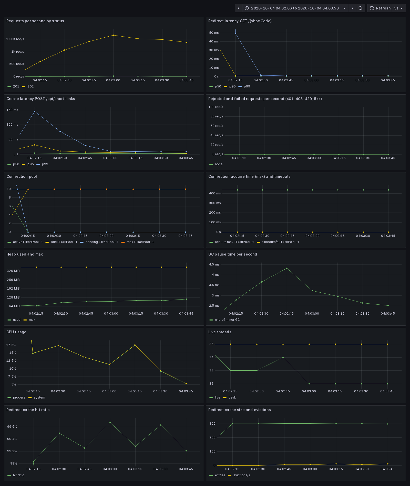
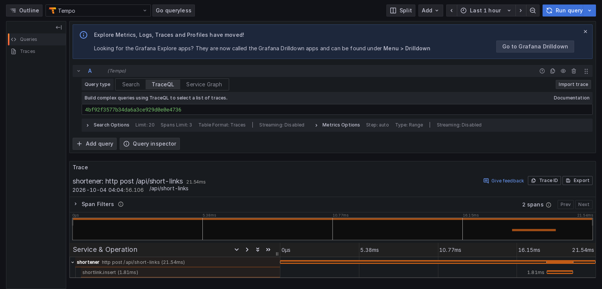

# Observability

What the service reports, and what to alert on. Locally, `docker compose --profile observability up -d` starts Prometheus,
Grafana (<http://localhost:3000>, no login), Tempo and the Postgres exporter, and `./gradlew bootRun` uses the `dev` profile
(100% trace sampling). The production overlay is in [DEPLOY.md](DEPLOY.md#operate).

- [At a glance](#at-a-glance)
- [Dashboard](#dashboard)
- [Traces](#traces)
- [Metrics](#metrics)
- [Alerts](#alerts)
- [Health, database](#health-database)
- [Logs](#logs)
- [Not done](#not-done)

## At a glance

| Signal | Where | Notes |
|---|---|---|
| Metrics | `/actuator/prometheus`, management port 8081 | never proxied by the edge |
| Dashboard | `deploy/observability/grafana/dashboards/shortener.json` | twelve panels |
| Traces | OTLP over HTTP to Tempo | sampling 0 by default, 100% under `dev`, 5% under `production` |
| Logs | JSON (ECS) on stdout under `production`, with trace and span ids | |
| Health | `/actuator/health/liveness`, `/readiness`, management port | readiness excludes the database |
| Alerts | `deploy/observability/alerts.yml` | twelve rules, tested with promtool |

## Dashboard

The dashboard at 1,500 requests a second (1% creates), with 2 cores and 512 MB. The cache answers about 99% of redirects, so
the connection pool stays idle.



| Panel | Series |
|---|---|
| Requests per second by status | `http_server_requests_seconds_count` by `status` |
| Redirect latency (p50, p95, p99) | `http_server_requests_seconds_bucket`, `uri="/{shortCode}"` |
| Create latency | the same, `uri="/api/short-links"` |
| Rejected and failed requests (401, 403, 429, 5xx) | `http_server_requests_seconds_count` by `status` |
| Connection pool | `hikaricp_connections_*` (active, idle, pending, max) |
| Connection acquire time and timeouts | `hikaricp_connections_acquire_seconds_max`, `hikaricp_connections_timeout_total` |
| Heap used and max | `jvm_memory_used_bytes`, `jvm_memory_max_bytes` |
| GC pause time per second | `jvm_gc_pause_seconds_sum` |
| CPU usage | `process_cpu_usage`, `system_cpu_usage` |
| Live threads | `jvm_threads_live_threads`, `jvm_threads_peak_threads` |
| Redirect cache hit ratio | `cache_gets_total` by `result` |
| Redirect cache size and evictions | `cache_size`, `cache_evictions_total` |

- A panel stays empty until its event happens.
- The native image has no JVM GC beans: its GC panel is empty and its heap maximum reads zero.
- Request series are labelled by route template, never by short code.

## Traces

A create request in Tempo: the HTTP span, and under it `shortlink.insert`.



| Span | Means |
|---|---|
| `http <method> <route>` | one per request, named by route (`http get /{shortCode}`), joined to the caller's trace by `traceparent` |
| `shortlink.load` | a redirect that missed the cache and read the database |
| `shortlink.insert` | one attempt to store a link; a code collision shows as a second insert |

- `shortlink.load` and `shortlink.insert` are also timers: `shortlink_load_seconds`, `shortlink_insert_seconds`.
- Trace and span ids are in the logs. Per-filter Spring Security observations are off.
- The OTLP endpoint has a default in `application.yaml`; environment variables override it at run time. Do not remove the
  default ([INTERNALS.md](INTERNALS.md#observability)).
- Export of logs and metrics over OTLP is off.

## Metrics

| Series | Type | Use |
|---|---|---|
| `http_server_requests_seconds` | histogram | rate, errors, latency by route and status |
| `hikaricp_connections_active`, `_idle`, `_pending`, `_max` | gauge | pool use |
| `hikaricp_connections_acquire_seconds_max` | gauge | longest wait for a connection |
| `hikaricp_connections_timeout_total` | counter | requests that gave up waiting for a connection |
| `cache_gets_total{cache="shortlink.redirect"}` | counter | cache hits and misses |
| `cache_size`, `cache_evictions_total` | gauge, counter | cache fill |
| `shortlink_redirect_cache_stale_total` | counter | redirects served from an expired entry while the database was down (should be zero) |
| `shortlink_load_seconds`, `shortlink_insert_seconds` | timer | database read of a redirect, each insert attempt |
| `shortener_security_events_total` | counter | `401`, `403`, `429` and requests for a DPoP nonce (`dpop_nonce_requested`) by `type` |
| `shortener_audit_events_total` | counter | creates, disables, administrator actions by `type` |
| `jvm_*`, `process_*` | | memory, GC, threads, CPU |
| `pg_*` | | the database, from the Postgres exporter |

## Alerts

`deploy/observability/alerts.yml`. In normal operation the pool is idle, so any database alert means the cache is not
absorbing load, or the database is slow or gone.

| Alert | Fires when | For | Severity |
|---|---|---|---|
| `ShortenerDatabasePoolExhausted` | requests are waiting for a connection | 2 m | warning |
| `ShortenerDatabaseConnectionTimeouts` | requests gave up waiting for a connection, or the database could not be reached | 1 m | warning |
| `ShortenerDatabaseSlowToConnect` | the slowest wait for a connection exceeds 500 ms | 10 m | warning |
| `ShortenerStorageUnavailable` | more than 1% of requests are answered `503` | 5 m | critical |
| `ShortenerServingStaleRedirects` | redirects are served from an expired entry because the database is unreachable | 2 m | warning |
| `ShortenerAuthenticationFailures` | more than one failed authentication a second | 10 m | warning |
| `ShortenerForbiddenCalls` | valid tokens denied more than once every five seconds | 10 m | warning |
| `ShortenerRateLimited` | more than one `429` a second | 10 m | warning |
| `ShortenerWalArchivingFailing` | Postgres failed to archive WAL in the last ten minutes | 5 m | critical |
| `ShortenerReplicaDisconnected` | the replication slot has no connection | 5 m | warning |
| `ShortenerReplicaLagging` | the replica is more than 100 MiB behind | 10 m | warning |
| `ShortenerAdministratorActivity` | more than ten disables or listings of other clients' links in ten minutes | none | warning |

Each rule has a test in `deploy/observability/alerts.test.yml`:

```bash
docker run --rm -v "$PWD/deploy/observability:/rules:ro" -w /rules --entrypoint promtool \
  prom/prometheus:v3.5.0 test rules alerts.test.yml
```

Prometheus evaluates the rules and shows them in its interface. Delivery needs an Alertmanager (see
`deploy/observability/prometheus.stack.yml`). Database server alerts (connections against `max_connections`, replication,
backup age, transaction age) are not included.

## Health, database

| What | Behaviour |
|---|---|
| Liveness | the process is up |
| Readiness | the application's own state only; excludes the database ([INTERNALS.md](INTERNALS.md#observability)) |
| Slow statements | `deploy/postgres/diagnostics.conf` logs statements over 250 ms with their plan, lock waits, sorts that spill to disk and slow autovacuums |
| Database metrics | `postgres_exporter` as `shortener_exporter`: 25 statements, no query text |
| Diagnostics | `perf/pg-diagnostics.sql`: connections by application and state, lock waits, costliest statements, cache hit ratio, dead rows, unused indexes, distance from transaction ID wraparound |

Every connection reports `shortener-<hostname>` as its application name.

## Logs

The `production` profile writes ECS JSON to the container output, plain text otherwise. Each line is one JSON object with
nested ECS names and the request's `traceId`. [ADR 0024](adr/0024-logging-and-audit.md).

| Look for | Logger | Fields |
|---|---|---|
| failed authentication, denied call, limited client, request for a DPoP nonce (info) | `uy.ct.shortener.security.events` | `event.action`, `event.reason`, `client.ip`, `auth.scheme`, `url.path`, `owner` (denied call) |
| link created or disabled, administrator acting on others | `uy.ct.shortener.audit` | `event.action`, `shortlink.code`, `actor`, `owner`, target host (create) |
| storage failing, configuration at start | the class that wrote it | exception type, settings |

```bash
docker service logs shortener_shortener 2>&1 | grep '"action":"disabled_by_admin"'
```

Tokens, proofs, query strings and target paths are never logged.

## Not done

- Metrics from the nginx edge.
- A Grafana dashboard for Postgres.
- Delivery of the alerts Prometheus fires.
