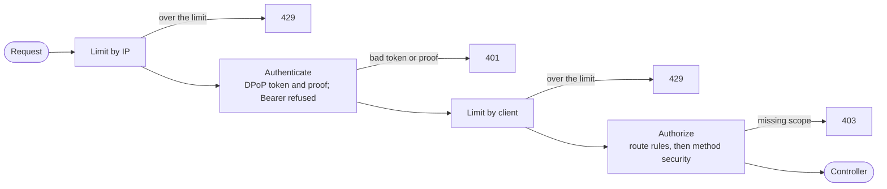
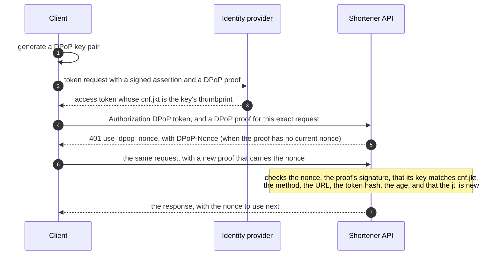

# Security

How the service decides who may call it, what they may do and how often, and why it does it this way. The threats these controls
answer, the register of findings and the risks accepted are in [THREAT_MODEL.md](THREAT_MODEL.md).

> [!NOTE]
> This covers the controls inside the application: the filter chain, tokens, DPoP, scopes and rate limits. The controls
> around it (database roles, container hardening, the edge, signed releases) are listed in
> [Beyond the application](#beyond-the-application), with the section that describes each.

- [Filter chain](#filter-chain)
- [Tokens](#tokens)
- [DPoP (RFC 9449)](#dpop-rfc-9449)
- [Authorization](#authorization)
- [Rate limiting](#rate-limiting)
- [Identity provider and OAuth 2.1](#identity-provider-and-oauth-21)
- [Beyond the application](#beyond-the-application)

## Filter chain

Stateless and deny by default, in this order: IP rate limit, authentication, client rate limit, authorization.

- `/api/**` needs authentication.
- `GET` and `HEAD` on `/{code}` and the health and Prometheus endpoints are public.
- Everything else is denied.
- Responses carry a restrictive CSP, `Referrer-Policy: no-referrer` and Spring Security's default headers.

## Tokens

- JWTs from Keycloak, validated locally against its JWKS: signature, issuer, audience (`shortener-api`), expiry and the
  JOSE type `at+jwt` (RFC 9068). No call to the identity provider per request.
- Issuer-agnostic: any provider that issues these tokens works. Keycloak is the reference.
- The claim named by `shortener.security.client-id-claim` (`owner` in the shipped config, `azp` by default) is the client id and is stored as the creator of every link.
- Only the `Authorization` header carries a token. A token in a query string or form body is ignored (tested).

## DPoP (RFC 9449)

Every access token must be bound to the client's key:

1. The client authenticates to the token endpoint with a signed assertion (`private_key_jwt`, ES256) and a DPoP proof.
   It receives a token whose `cnf.jkt` is the thumbprint of its DPoP key.
2. Each call sends `Authorization: DPoP <token>` and a `DPoP` proof for that exact request: method (`htm`), URL without
   query (`htu`), token hash (`ath`), a unique `jti`, the time and the server's nonce (`nonce`).
3. The nonce is checked first, then Spring Security checks the signature, that the key matches `cnf.jkt`, method, URL, token
   hash, age and that the `jti` is new.
4. A proof without the current nonce is answered `401` with `error="use_dpop_nonce"` and the nonce in `DPoP-Nonce`, and the
   client repeats the request once with a new proof ([ADR 0032](adr/0032-dpop-nonces.md)).

Properties:

- The DPoP key is not the client's identity. The client is authenticated by its registered assertion key. The DPoP key
  is generated by the client, bound to one token and can be rotated freely.
- A stolen token is useless without the private key, and the `Bearer` scheme is refused even for a valid token.
- Behind a gateway, `htu` is built from the forwarded host and scheme, so forwarded headers are handled by Tomcat's
  trust-aware valve.
- The replay cache is in memory and per instance. A proof is remembered 30 s, at most 1,000 per DPoP key, about 33
  requests a second per key. A client can use several keys, so this is not a client limit.
- The nonce is an HMAC of the current five-minute interval, good for that interval and the next, and stateless: any instance with
  the secret checks one it did not make. The secret is the Docker secret `dpop_nonce_secret`, required in `production`, and
  `shortener.security.dpop.nonce.enabled=false` turns nonces off. Asking for one is counted as `dpop_nonce_requested`, not as a
  failed authentication.
- `shortener.security.dpop.required=false` also accepts plain bearer tokens (development and tests). `production` does not start with it
  off: its own file says `true`, and an environment variable that says `false` would win over a file, so the value is checked when the
  chain is built ([ADR 0035](adr/0035-production-refuses-bearer-tokens.md)).
- `/.well-known/oauth-protected-resource` (RFC 9728) tells clients the authorization server and that DPoP is required.

## Authorization

Scopes decide what a client may do, and their names are configuration. Checks are declared on the service with method
security meta-annotations (`@MayCreate`, `@MayClaim`, `@MayRead`, `@MayList`, `@MayDisable`).

| Scope | Allows | Needs also |
|---|---|---|
| `shortlinks:create` | create a link with a generated code | |
| `shortlinks:claim` | choose the code | `shortlinks:create` |
| `shortlinks:read` | read and list the client's own links | |
| `shortlinks:delete` | disable the client's own links | |
| `shortlinks:admin` | read and disable any client's links | |

- Ownership is a rule on top of scopes: the `createdBy` and `disabledBy` arguments, an `Actor.Client`, must name the caller
  (`#createdBy.name == authentication.name`), and a listing filter must be limited to the caller
  (`#filter.isLimitedTo(authentication.name)`).
- A `PermissionEvaluator` lets a caller manage a link only if it created it, or is an administrator.
- A denied link read becomes `404` through `@HandleAuthorizationDenied`.

### Wiring that is easy to break

- `ShortLinkScopes` is bound through its constructor, so it is immutable after start, and its defaults are `@DefaultValue`s:
  Kotlin default arguments would add a no-argument constructor that Spring rejects. A blank scope name stops startup, because
  it would make an operation unreachable or open to the wrong tokens.
- Constructor-bound properties cannot be components, so `ShortLinkScopesConfiguration` gives the object the bean name `scopes`
  that the expressions use (`@scopes.read`). It is the primary bean of its type.
- `ManageableLinks` is a bean of its own because method security applies only to calls made through a Spring proxy.
- `ShortLinkPermissionEvaluator` resolves the scopes lazily, because method security needs it while the context is starting.
  The method-security handler is a static infrastructure bean for the same reason: it must not force other beans to
  initialise early.

## Rate limiting

- Token buckets in memory (Bucket4j): one per IP before authentication, one per client after it. The capacities are
  [tunables](REFERENCE.md#tunables).
- State is per instance, so the effective limit is the limit times the replicas. A global limit needs a shared store.
- Buckets live in a size-bounded Caffeine cache and expire once idle for a full refill period, so a flood of distinct keys
  cannot exhaust memory.
- Actuator paths are never limited, so health checks cannot be starved.
- Each `RateLimitFilter` instance needs a distinct name: `OncePerRequestFilter` remembers a filtered request by filter name,
  so two instances sharing one would skip each other.

> [!WARNING]
> Everyone behind one address shares the IP bucket. A newsletter link or a carrier NAT can be answered with `429`
> by readers who did nothing ([ADR 0008](adr/0008-rate-limits-per-instance-in-memory.md)).

## Identity provider and OAuth 2.1

`deploy/keycloak/shortener-realm.template.json` defines the scopes, the audience mapper and four clients (`demo`, `other`,
`admin`, `no-scope`): confidential, service-account only, implicit and password grants off. It holds placeholders where
the keys and the web users' passwords go. `deploy/keycloak/dev-setup` makes the keys with the client's `keygen` and fills them in,
which writes the realm Keycloak imports. Nothing secret is committed, so each developer has their own keys. Against the OAuth 2.1 draft
that covers tokens only in the header, no deprecated grants, five-minute tokens, sender-constrained tokens and
asymmetric client authentication. The draft is not final, so this is alignment, not conformance.

## Beyond the application

| Concern | Control | Where it is described |
|---|---|---|
| What the database lets the application do | three roles, so the application cannot delete or rewrite a link | [Roles and migrations](INTERNALS.md#roles-and-migrations), [ADR 0013](adr/0013-three-database-roles-and-a-migration-job.md) |
| What the containers can do | read-only root, no capabilities, not root, secrets as files | [Hardening](INTERNALS.md#hardening) |
| What reaches the application | TLS, replaced forwarded headers, body and connection caps | [Edge](INTERNALS.md#edge) |
| Traffic between services | encrypted; mutual TLS is proposed and not built | [ADR 0021](adr/0021-encrypt-internal-traffic.md), [ADR 0022](adr/0022-mtls-between-services.md) |
| Secrets | none in Git, generated per developer | [ADR 0019](adr/0019-no-secrets-in-git.md) |
| What an error looks like | one problem-detail shape, also for `401`, `403` and `429` | [Errors](INTERNALS.md#errors), [ADR 0009](adr/0009-problem-details-for-every-error.md) |
| What is deployed | a signed, scanned image, verified before it is deployed | [Releasing](INTERNALS.md#releasing), [ADR 0018](adr/0018-signed-scanned-releases.md) |
| Who did what | audit events for creates and takedowns | [ADR 0024](adr/0024-logging-and-audit.md) |
