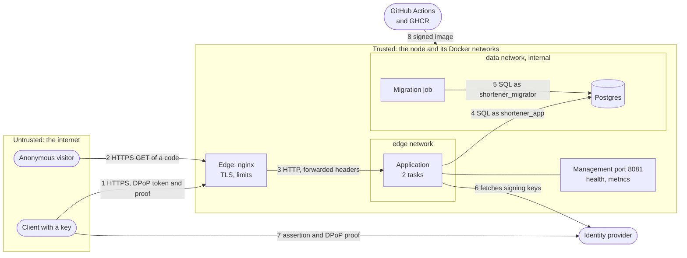

# Threat model

What can go wrong with this service, what stops it, and what does not, against STRIDE and the OWASP Top 10. Controls
are described in [INTERNALS.md](INTERNALS.md#security) and the [ADRs](adr/README.md).

**Status: a review of the code and the stack as of 0.20.0, by reading them. Nothing was tested against a running public
instance and there was no penetration test.** A control with a test names it. A claim inferred from configuration says so.

- [Scope and assumptions](#scope-and-assumptions)
- [What it protects](#what-it-protects)
- [Who attacks it](#who-attacks-it)
- [Data flows and trust boundaries](#data-flows-and-trust-boundaries)
- [STRIDE](#stride)
- [Abuse of a working service](#abuse-of-a-working-service)
- [OWASP Top 10:2025](#owasp-top-102025)
- [OWASP API Security Top 10:2023](#owasp-api-security-top-102023)
- [Findings](#findings)
- [Risks accepted](#risks-accepted)
- [Keeping it current](#keeping-it-current)

## Scope and assumptions

In scope: the application, the production stack (`compose.prod.yaml`, the nginx edge, Postgres), the migration job, the
release pipeline and the use of the identity provider. The web UI and the public instance are plans ([UI.md](UI.md),
[CLOUD.md](CLOUD.md)); what changes for them is marked **public**.

Assumptions:

- **A short link is a public capability.** Anyone who knows a code learns its target by following it. The target is not a
  secret and the service does not try to keep it one.
- **The identity provider is trusted and correct.** It authenticates clients, issues the scopes and fills the `owner`
  claim. Its compromise is outside what this service can contain ([F-02](#findings)).
- **TLS ends at the edge.** Between the edge and the application the traffic crosses a private Docker network.
- **The host and the Docker daemon are not hostile.** Someone with root on the node reads every secret.
- **The operator is trusted** with the `.env`, the secrets directory and the administrator client.

Out of scope: the cloud provider, the developer's machine, the GitHub account, denial of service by volume that only a
provider can absorb, and the dev realm, which must never run anywhere real.

## What it protects

| Asset | Why it matters | Where it lives |
|---|---|---|
| **Integrity of the mapping** code to target | A changed target turns every link into a phishing link | `short_link` in Postgres, the redirect cache |
| **Ownership** of each link | A client must not read or disable another's | `created_by`, the `owner` claim |
| **Availability of redirects** | Following a link is the product | cache, Postgres, the edge |
| **Reputation of the domain** | A shortener's domain is blocklisted once it carries abuse | the host name, the target policy |
| **Client credentials** | Assertion keys, DPoP keys, tokens | the client's machine, the identity provider |
| **Service secrets** | Database passwords, the TLS key | Docker secrets, files in `secrets/` |
| **Ability to take a link down** | The remedy for abuse | `shortlinks:admin`, the administrator client |
| **The image that runs** | Code with the application's access | GHCR, the nodes |

## Who attacks it

| Actor | Can | Wants |
|---|---|---|
| **Anonymous visitor** | follow links, guess codes, send any HTTP | enumerate links, exhaust the service |
| **Abuser with a client** | create links within the limits | phish, spam, host malware redirects, squat codes |
| **Malicious client** | hold valid scopes and a key | read or disable another client's links, escalate to admin |
| **Network attacker** | observe or alter traffic outside TLS | steal tokens, replay requests |
| **Compromised application** | run code as `shortener_app` | change targets, delete links, reach the database as the owner |
| **Supply-chain attacker** | tamper with a dependency, an image or the pipeline | run code in production |
| **Insider or operator error** | misconfigure | set `allow-any` on a public instance, expose a port, ship the dev realm |

## Data flows and trust boundaries

| Boundary | Crossing | What is checked there |
|---|---|---|
| Internet to edge (1, 2) | TLS, headers, body | TLS 1.2+, body 16 KiB, timeouts, connections per address |
| Edge to application (3) | forwarded headers | edge replaces them, the application trusts them only from private addresses |
| Application to database (4) | SQL | bound parameters, least-privilege role, timeouts |
| Application to identity provider (6) | signing keys | issuer, audience, type, expiry, DPoP binding |
| Pipeline to node (8) | the image | tests, scan, signature, digest |

## STRIDE

Ratings are for a **public** instance with strangers and open creation. A private instance with a few trusted clients
rates most of them one level lower. `F-nn` points to the [findings](#findings).

### E1. The edge (nginx)

| | Threat | What stops it | Residual |
|---|---|---|---|
| S | Forged `X-Forwarded-For` to dodge the address limit | nginx replaces the header with `$remote_addr`. Tomcat trusts forwarded headers only from private addresses | once IPv6 is enabled, clients rotate inside their /64. The edge listens on IPv4 only today ([F-09](#findings)) |
| S | A forged `Host` | none: `server_name _` accepts any, and the value is forwarded | reflected to the sender, low ([F-08](#findings)) |
| T | TLS stripping, downgrade | plain HTTP only redirects, HSTS for a year, TLS 1.2 and 1.3, no session tickets | the first request of a client that calls `http://` sends its headers in clear before the redirect. Clients must use `https://` |
| R | No trail of who called | JSON access log with address, status, route and upstream, no query string | the edge's log and the application's are local, three files of 10 MB each ([F-03](#findings)) |
| I | Server version, internal errors, management port | `server_tokens off`, error detail suppressed in production, the management port is never proxied | access logs hold client addresses, which are personal data |
| D | Slow clients, big bodies, floods | header and body timeouts 10 s, body 16 KiB, 100 connections per address, Tomcat caps at 500 | no global limit and no per-address limit across many addresses |
| E | Escaping the container | unprivileged, read-only, no capabilities, `ComposeStackTest` | host-level compromise is out of scope |

### E2. The API: authentication and authorization

| | Threat | What stops it | Residual |
|---|---|---|---|
| S | Forging or confusing a token | signature against the provider's keys, issuer, audience `shortener-api`, expiry, type `at+jwt`, a token without `owner` is invalid (`SecurityIntegrationTest`) | the provider issues what it is told to |
| S | Using a stolen token | DPoP: a proof for this method, URL and token, signed by the bound key. `Bearer` refused even for a valid token (`DpopIntegrationTest`) | stealing the key as well |
| S | Replaying a captured request | the `jti` must be new, proofs expire in 30 s (`DpopIntegrationTest`) | the cache is per instance, so each of two instances accepts one replay inside the window. Needs a break of TLS first |
| S | Token in a query string or body | only the `Authorization` header is read (`SecurityIntegrationTest`) | |
| T | Altering a request in flight | TLS. The proof covers method, URL and token, **not the body** | a party past TLS can change the body of a signed request |
| T | Choosing another owner, sorting by a column, a bad code | the owner argument must equal the caller, `sort` is a whitelist of columns, the code is validated by regex, the target twice | |
| R | Denying an action | `created_by`, `disabled_by` and times are stored, and the application role cannot change `created_by`. The first disabler is kept (`COALESCE`) | events and an audit trail are logged ([ADR 0024](adr/0024-logging-and-audit.md)), locally ([F-03](#findings)). An administrator reading one client's single link is not recorded |
| I | Reading another client's link | `404`, not `403`, so existence is not revealed (`AuthorizationIntegrationTest`, `UserOwnershipIntegrationTest`). A listing filter must be the caller's | an administrator sees everything, by design |
| I | Error text | RFC 9457 bodies without internals in production | |
| D | Flooding as a client | 60 a minute per client, 300 per address, `429` with `Retry-After` | no quota on stored links ([F-04](#findings)). A deep page costs more than a shallow one ([F-12](#findings)) |
| E | Taking another scope | scopes are the token's. `claim` needs `create` too. `admin` is its own scope, and a client with only `admin` cannot create | what the provider grants. An admin scope is the key to every link |
| E | CSRF | no cookies, no session, the token is a header. CSRF protection is off on purpose | a future UI that stores tokens in the browser changes this |

### E3. The redirect (public)

| | Threat | What stops it | Residual |
|---|---|---|---|
| S | Passing off a link as trustworthy | the domain is the service's, so it lends trust to whatever it points to | [ADR 0023](adr/0023-production-must-decide-its-targets.md), [Abuse](#abuse-of-a-working-service) |
| T | Changing the target of an existing link | no endpoint edits a target, and the application role has no `UPDATE` on it (`DatabaseRolesTest`) | the migrator role and the operator can |
| T | Header injection through the target | the target is parsed as a `URI`, which rejects line breaks, and only `http` and `https` are accepted | |
| T | Stale target after takedown | the disabling instance evicts at once | other instances serve it up to 30 s, and up to 5 minutes if the database is down |
| R | Who followed a link | not recorded, by design: no analytics | |
| I | Enumerating codes | generated codes are 7 base62 characters from `SecureRandom`, about 3.5 x 10^12 | custom codes are guessable by nature. A `410` says a code once existed |
| D | Random codes to reach the database | the cache answers hot links. A miss is a primary-key read with a 5 s limit. 300 a minute per address. A database failure is `503`, and links already read keep redirecting | many addresses can keep the pool of ten busy and make cold reads fail |
| E | Redirecting to a non-web scheme | `javascript:` and `data:` are refused | |

### E4. The identity provider and its keys

| | Threat | What stops it | Residual |
|---|---|---|---|
| S | A fake provider for the key endpoint | issuer and audience are checked | the key URL and issuer come from configuration. With the stack's Keycloak the key URL is `http` on the encrypted network, so a check must be on the issuer ([F-10](#findings)) |
| T | A client mints its own `owner` | the mapper sets it, and the client's own attributes are not the source | the security of ownership is the mapper's ([ADR 0007](adr/0007-owner-claim-and-ownership-rule.md)) |
| D | The provider is down | tokens validate locally and last 5 minutes, so existing sessions work. The token endpoint is limited to ten requests a second per address | one Keycloak and one database: no new token until it returns |
| E | A compromised provider | the service trusts it fully. Keycloak is hardened like every service, its console is not on the edge and its master realm is not reachable from outside ([ADR 0025](adr/0025-keycloak-in-the-stack.md)) | an administrator of Keycloak can mint any token. Its image is not scanned or signed by the pipeline ([F-13](#findings)) |

### E5. Postgres

| | Threat | What stops it | Residual |
|---|---|---|---|
| S | Using the database password | secrets are files in memory, one per role, the `data` network has no route out and only stack services attach | the link between the application and the database is not TLS unless the URL says so |
| T | Injection, or a compromised application rewriting links | bound parameters. The application role can `SELECT`, `INSERT` and set `disabled_at` and `disabled_by`: no `DELETE`, `TRUNCATE`, target change or DDL (`DatabaseRolesTest`) | it can still disable every link and insert new ones |
| T | A migration that locks the table | `MigrationConventionsTest`, the migrator's `lock_timeout` | |
| R | Who changed a row | `created_by`, `disabled_by` | no audit table |
| I | The exporter reading data | `shortener_exporter` has `pg_monitor`: statistics, not data (`DatabaseRolesTest`) | |
| D | A query or lock that pins a connection | 5 s, 2 s and 10 s limits that apply at login | one node, no replica, **no backup**: losing the volume loses every link |
| E | Another role creating objects | `CREATE` on the schema is revoked from `PUBLIC`. Only listed roles connect | Postgres starts as root and drops, with five capabilities |

### E6. Build, release and deploy

| | Threat | What stops it | Residual |
|---|---|---|---|
| S | A forged release | the tag must equal the version, the image is signed with the workflow's identity | nothing verifies the signature when deploying ([F-06](#findings)) |
| T | A poisoned dependency or image | tests, a scan that fails on a fixable high or critical finding, an SBOM, pinned buildpacks and base image | [F-05](#findings) |
| R | Which build runs | the digest is resolved at deploy, the SBOM and signature are attached | the workflow has not run yet |
| I | Secrets in the repository | generated dev keys, `.env` and `secrets/` ignored by Git ([ADR 0019](adr/0019-no-secrets-in-git.md)) | the old dev keys are in the history |
| E | The workflow acting beyond its need | read-only by default, `packages: write` and `id-token: write` only in the release job | actions pinned by tag, not commit |
| E | `deploy.sh` running something it should not | | it `eval`s the names found in `.env` ([F-11](#findings)) |

### E7. The management port and telemetry

| | Threat | What stops it | Residual |
|---|---|---|---|
| I | Reading metrics or health | the port is never proxied, details are hidden in production, metrics are labelled by route template so codes are not values | anything on the `edge` or `data` network can read them without a login (`SecurityIntegrationTest` states they are public) |
| I | Traces carrying data | 5% sampling, no OTLP log or metric export | the default OTLP endpoint is plain HTTP on localhost |
| D | Alert fatigue or silence | nine alerts: the database, stale redirects, failed authentications, denied calls, rate limiting and administrator activity | four alerts read `401`, `403`, `429` and administrator activity. Nothing sends the alerts that fire ([F-03](#findings)) |

## Abuse of a working service

These need no vulnerability, only the service doing its job.

| Abuse | Effect | What exists | What is missing |
|---|---|---|---|
| **Phishing and malware through short links** | the domain is blocklisted, users are harmed | the allowlist of target hosts ([ADR 0015](adr/0015-target-host-policy.md)), the limits, takedown by `DELETE` | the allowlist must be decided in production ([ADR 0023](adr/0023-production-must-decide-its-targets.md)), and `allow-any` stays a choice. No intake for reports, no check against a list of bad URLs |
| **Squatting codes** | a client claims `login`, a brand or a typo of one | `claim` is a separate scope, `api`, `actuator` and `error` are reserved | no reserved list beyond routes, no review |
| **Link farms** | a client fills storage | 60 creates a minute | no quota ([F-04](#findings)) |
| **Redirect chains and loops** | a target that is itself a short link of this service | none | not detected. Harmless to the service, bad for visitors |
| **A takedown that comes late** | a bad link works for 30 s, or 5 minutes in an outage | eviction on the disabling instance | the window is the price of the cache ([ADR 0011](adr/0011-in-process-redirect-cache.md), [0012](adr/0012-readiness-excludes-the-database.md)) |
| **Taking down links of others** | a client with `admin` disables everything | the scope is held by one client, each action is logged with its actor, and an alert fires on a burst | nothing delivers the alert ([F-03](#findings)) |

## OWASP Top 10:2025

Status: **Covered** (a control and, where possible, a test), **Partial** (a control with a stated gap) or **Gap**.

| | Category | Status | How it applies here | Findings |
|---|---|---|---|---|
| A01 | Broken Access Control | Covered | Deny by default. Scopes on operations, ownership over them, `404` for what the caller may not see, no IDOR on codes or filters. No cookies, so no CSRF. CORS is not configured. No SSRF entry point: the service never fetches a target. | the admin scope is powerful, [F-02](#findings) |
| A02 | Security Misconfiguration | Partial | Hardened containers (`ComposeStackTest`), production profile, management port never proxied, headers (CSP `default-src 'none'`, `no-referrer`, HSTS). The dev realm is `sslRequired: none` and says dev only. | any `Host` accepted [F-08](#findings), issuer scheme [F-10](#findings) |
| A03 | Software Supply Chain Failures | Partial | Pinned buildpacks and base image, a scan, a signature and an SBOM on release, Dependabot for actions. | [F-05](#findings), [F-06](#findings) |
| A04 | Cryptographic Failures | Partial | TLS 1.2 and 1.3 at the edge, ES256 assertions, SHA-256 thumbprints, `SecureRandom` for codes, secrets as files. The service stores no password. | overlays are encrypted between nodes but peers are not authenticated; an external database needs `sslmode` ([F-07](#findings)) |
| A05 | Injection | Covered | Bound parameters everywhere; the only dynamic SQL is an `ORDER BY` from a whitelist. Code and target are validated and the target parsed as a `URI`. No shell or template takes user input. The application role cannot run DDL. | |
| A06 | Insecure Design | Partial | This document, the ADRs, abuse cases, separated database roles. Production no longer accepts every target by omission. | [F-04](#findings) |
| A07 | Authentication Failures | Covered | No passwords in the service, `private_key_jwt`, five-minute sender-bound tokens, address limit before authentication, a token in the wrong place is refused. | the provider's own hardening [F-02](#findings) |
| A08 | Software or Data Integrity Failures | Partial | Signed images, Flyway checksums, migration rules, a replay cache for proofs. Targets cannot be edited by the application. | [F-06](#findings), no Gradle dependency verification ([F-05](#findings)) |
| A09 | Security Logging and Alerting Failures | Partial | The edge logs every request as JSON. The application logs a line and a counter for every `401`, `403`, `429`, create, disable and administrator action on others' links, without credentials; four alerts read them ([ADR 0024](adr/0024-logging-and-audit.md)). | logs stay local, nothing delivers alerts, [F-03](#findings) |
| A10 | Mishandling of Exceptional Conditions | Covered | Failures close: a token without `owner` is invalid; an empty allowlist entry, or DPoP required without its filter, stops startup. Every error is a problem detail without internals. A database failure is `503` with `Retry-After`; an unmapped one is not hidden. Limits on connections, pool, statements and locks. | stale redirects in an outage ([ADR 0012](adr/0012-readiness-excludes-the-database.md)) |

## OWASP API Security Top 10:2023

Most rows map to the table above.

| | Risk | Status | Note |
|---|---|---|---|
| API1 | Broken Object Level Authorization | Covered | the permission evaluator and `ManageableLinks`, tested for two clients and two people on one client |
| API2 | Broken Authentication | Covered | see A07 |
| API3 | Broken Object Property Level Authorization | Covered | the response has a fixed shape. A client sets only `targetUrl` and `customCode`. `createdBy` comes from the token |
| API4 | Unrestricted Resource Consumption | Partial | limits, bounded pages (200), body 16 KiB. No quota ([F-04](#findings)), deep pages ([F-12](#findings)) |
| API5 | Broken Function Level Authorization | Covered | each operation names its scope, `claim` and `admin` are separate |
| API6 | Unrestricted Access to Sensitive Business Flows | Partial | creating links is the sensitive flow, and the controls are the limits and the allowlist ([ADR 0023](adr/0023-production-must-decide-its-targets.md)) |
| API7 | Server Side Request Forgery | Covered | no feature fetches a user-supplied URL. This changes if previews or a reputation check are added |
| API8 | Security Misconfiguration | Partial | see A02 |
| API9 | Improper Inventory Management | Covered | `openapi.yaml` is tested against the code and lists every operation. The management port is separate |
| API10 | Unsafe Consumption of APIs | Covered | the only upstream is the identity provider, whose tokens are validated. [F-10](#findings) |

## Findings

Ordered by severity for a public instance. None is a known exploit. *Known* marks limits that were already documented.

| ID | Severity | Finding | Why it matters | Recommendation |
|---|---|---|---|---|
| F-01 | ~~High~~ **Fixed** 2026-10-06 | The production profile now refuses to start with no list unless `allow-any` is set on purpose ([ADR 0023](adr/0023-production-must-decide-its-targets.md)) | `allow-any=true` on a public instance is still possible, and is now a visible choice | review `.env` before a public deployment |
| F-02 | Medium, **mostly fixed** 2026-10-06 | A production Keycloak is now in the stack as an optional overlay: hardened, with its own database and role, a realm of two clients with no users, the edge limited to the shortener realm, and brute-force detection ([ADR 0025](adr/0025-keycloak-in-the-stack.md)). Rehearsed on one machine, not deployed. What remains is in F-13 | the provider decides ownership and admin: its compromise or a wrong mapper still breaks every control | review the mappers against [ADR 0007](adr/0007-owner-claim-and-ownership-rule.md), and keep the key of `admin-client` with one person |
| F-03 | Medium, **partly fixed** 2026-10-06 | Security events, an audit trail and degradation notices now exist, each a line and a counter, with four alerts ([ADR 0024](adr/0024-logging-and-audit.md)). Still open: the logs are local and nothing ships them, nothing delivers the alerts that fire (*known*), and a listing of one's own links is not recorded | the trail disappears with the container's three log files, and nobody is told when an alert fires | ship the logs (Loki or the provider's) and connect Alertmanager |
| F-04 | Medium | No quota on links per client. 60 a minute is 86,400 a day for one client | storage and the domain's reputation | a quota per client, or a separate and lower bucket for creates |
| F-05 | Medium | Dependabot watches only the actions. Not Gradle, not the container images. No Gradle dependency verification. Third-party images are pinned by tag, not digest. The actions are pinned by tag. The scan runs only on release and ignores findings with no fix | a vulnerable or swapped dependency reaches production between releases | add the `gradle` and `docker` ecosystems to Dependabot, `gradle/verification-metadata.xml`, scan on pull requests, pin by digest once stable |
| F-06 | Medium | Nothing verifies the image signature at deploy. The release workflow has not run yet (*known*) | the signature protects nothing until somebody checks it | `cosign verify` in `deploy.sh`, with the workflow identity, before `docker stack deploy` |
| F-07 | Medium, multi-node, **partly fixed** 2026-10-06 | Both overlays are now encrypted ([ADR 0021](adr/0021-encrypt-internal-traffic.md), `ComposeStackTest`). What remains: peers are not authenticated, and an external database needs `sslmode=verify-full` set by the operator | a container on a stack network can still call the application as the edge | mutual TLS is proposed in [ADR 0022](adr/0022-mtls-between-services.md). Build it when there is more than one node or something untrusted can attach |
| F-08 | Low | The edge accepts any `Host` and forwards it as `Host` and `X-Forwarded-Host`. The `Location` of a `201` and the DPoP check use it, and the HTTP redirect uses `$host` | the effect is reflected to the sender and a DPoP proof must still match, so it is small. It is the pattern that becomes a cache or link poisoning when something is added | a `server_name` for the real host, and a default server that closes the connection |
| F-09 | Low, latent | The address limit keys on the full address, and so does the connection cap at the edge. The edge listens on IPv4 only (`listen 8443`, no `[::]`), so it does not bite today | the day IPv6 is enabled, one client with a /64 has 2^64 addresses and no limit | key on the /64 for IPv6 before enabling it |
| F-10 | Low | The issuer and key URL come from the environment and nothing requires `https`. The stack's own Keycloak is reached by `http` over the encrypted network on purpose | a misconfiguration would fetch signing keys from an address nobody checked | a production check that the issuer starts with `https://`, and that a key URL with `http` names a host of the stack |
| F-11 | Low | `deploy/stack/deploy.sh` expands the names it reads from `.env` inside an `eval` without checking them | only the operator writes that file, so it is not an attack. It is the shape that becomes one | accept only names that match `[A-Z_][A-Z0-9_]*` |
| F-12 | Low | A listing's page number is unbounded, an offset costs more with depth, and an administrator's unfiltered count scans the table (*known*, [ADR 0014](adr/0014-offset-pagination-with-totals.md)) | an authenticated client can make the database do more work per request than a redirect does, bounded by 60 a minute | cap the page depth, or move to keyset paging when the table is large |
| F-13 | Low | The Keycloak image is built by the operator, not by the release workflow: no scan, signature or bill of materials. Keycloak sits on the `edge` network, which has a way out, and its database is not backed up. A bad realm file or a restart loop is only visible in its log | the most trusted component has the least supply-chain evidence | build, scan and sign it in the release workflow ([ADR 0018](adr/0018-signed-scanned-releases.md)), back up its database with the rest, and alert on its health |

## Risks accepted

Decided. Revisit the reason, not the decision, when it stops being true.

| Risk | Why it is accepted |
|---|---|
| A takedown takes up to 30 s, or 5 minutes in a database outage | the price of a cache that keeps redirects up. Lowering the TTL costs database reads ([ADR 0011](adr/0011-in-process-redirect-cache.md)) |
| Rate limits and the proof replay cache are per instance | no shared store to run. The limit is multiplied by the replicas ([ADR 0008](adr/0008-rate-limits-per-instance-in-memory.md)) |
| `410` tells a visitor that a code once existed | the contract says a disabled link keeps its code taken, and links are public |
| The DPoP proof does not cover the body | DPoP does not define it, and TLS protects the body in transit |
| Management metrics have no login | the port is never proxied and only stack containers reach it |
| The application role can disable any link | disabling is its job, and nothing in it can delete or re-point one |
| Swarm ignores `no-new-privileges` | the images have no setuid binaries, and Postgres has no capabilities to escalate with |
| One database node, no backup | stated in the stack's limits. Not acceptable for an instance that holds anything that matters ([CLOUD.md](CLOUD.md)) |
| The old dev keys are in the Git history | they work against no setup made since |
| Egress is not filtered by destination | Swarm cannot, and the application only needs the identity provider and Postgres |

## Keeping it current

Update this document when:

- a component, a way in or a kind of data is added (web UI: browser token storage, XSS, CORS; target previews: SSRF);
- an ADR is accepted or superseded, so each row still names the control that exists;
- a finding is fixed: move it out of the table and record it in the ADR that fixed it;
- before the first public instance: the findings marked **public** are the list to clear.
